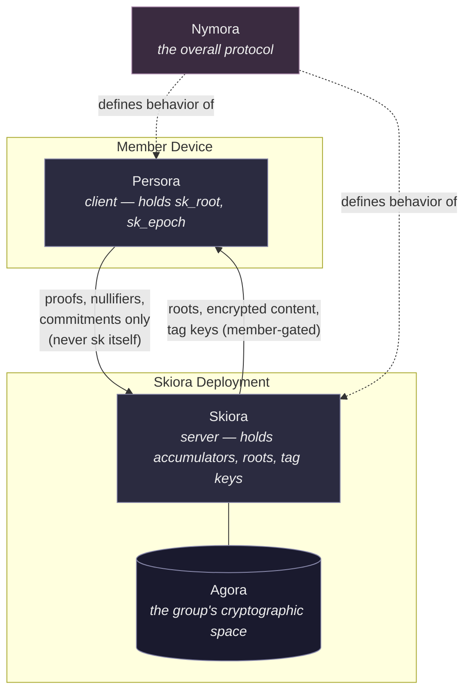
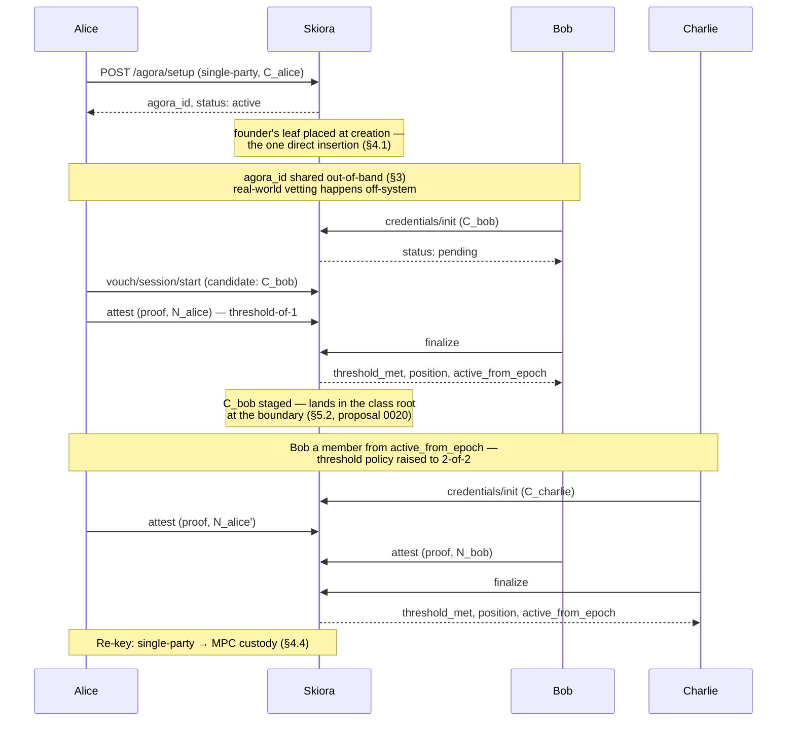
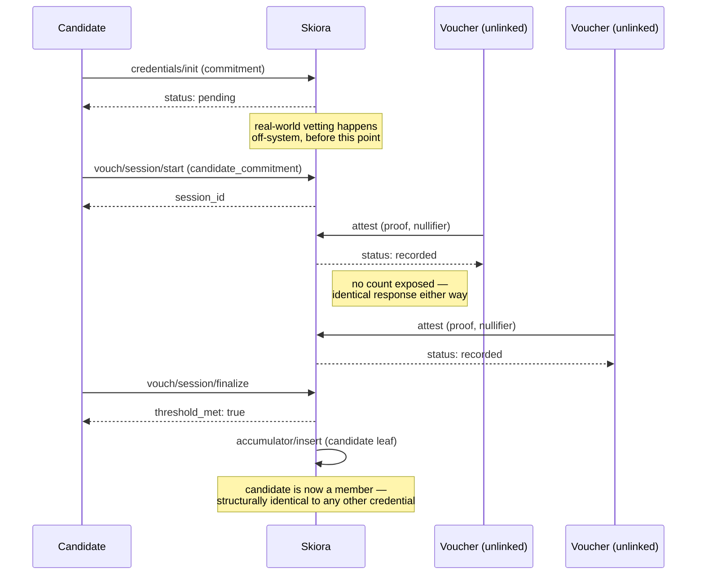
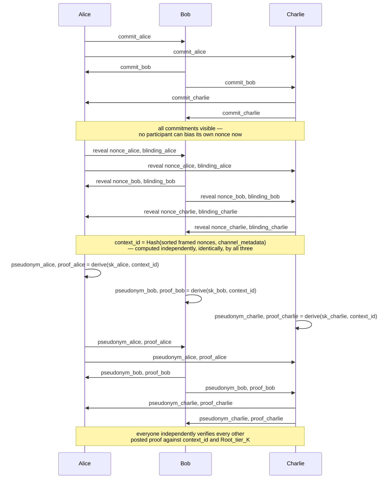
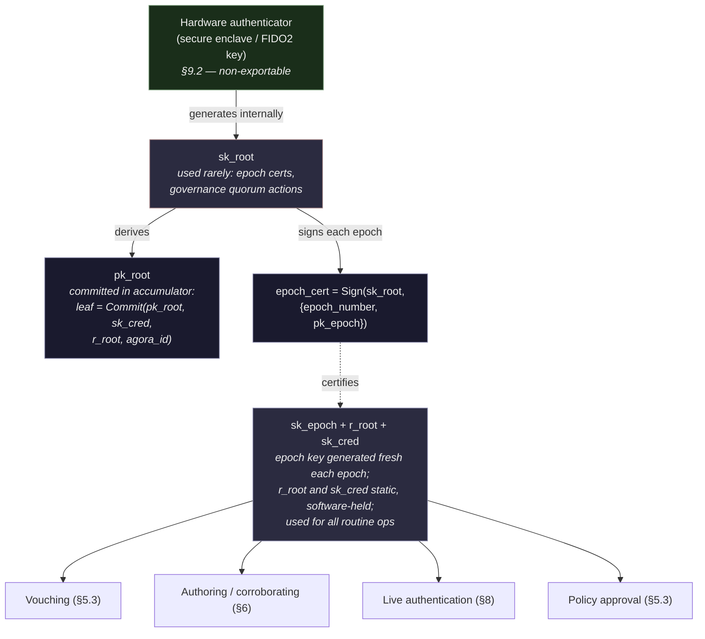
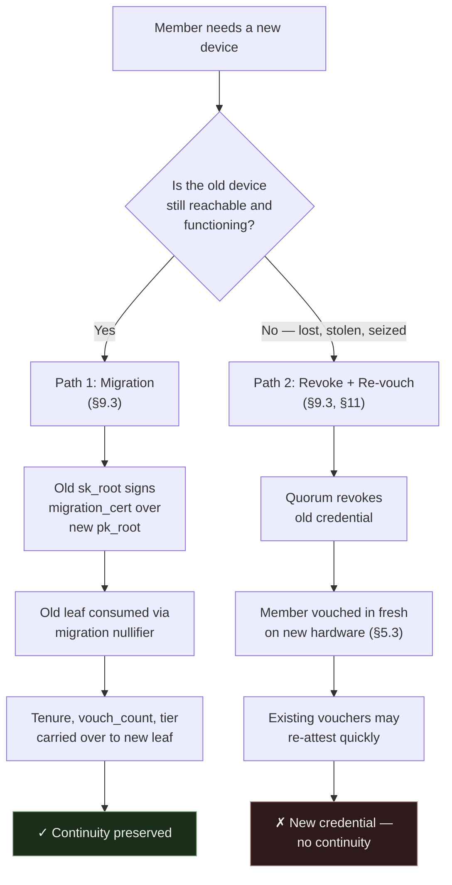

# Nymora Protocol Specification

**Status:** Design draft
**Scope:** Cryptographic architecture, API surface, mechanisms

Nymora lets a group of people organize, admit new members, and publish content
anonymously, authentically, and with provable dissolution. This document is the
**normative specification** — the mechanisms a conformant **Skiora** (server) and
**Persora** (client) implementation must follow.

Read alongside:

- **[threat-model.md](threat-model.md)** — §1 (purpose, adversary model) and §15 (known
  limitations). Start there for *what this design does and does not solve*.
- **`../tests/`** — conformance vectors, the executable form of this specification.

> **Section numbers are stable identifiers.** They are cited from source code and from the
> other documents (e.g. `§6.5`, `§9.2`). Numbering is preserved across the split into
> `nymora-protocol.md` and `threat-model.md` — **never renumber sections.** Append new
> ones instead.

---

## 2. Core Vocabulary

| Term | Meaning |
|---|---|
| **Nymora** | The overall protocol/system. |
| **Agora** | One instance of a group's private, tiered space. Fully independent cryptographic domain. |
| **Skiora** | The running deployment that actually holds and operates an agora's cryptographic material — credentials, accumulators, tag keys, key ceremonies, dissolution logic. Self-hosted or run by a chosen operator; not tracked by any external registry. |
| **Persora** | The client application — web or native — that a member uses to hold their credential, generate proofs and pseudonyms, and interact with an agora's Skiora. The "mask" a member wears when presenting themselves anonymously. |
| **`agora_id`** | Opaque, self-generated identifier for an agora — derived from its own public key material, not issued or tracked by any external party. |
| **Tier** | A membership level within an agora, gating access to content and privileges. |
| **Credential** | A member's anonymous, attribute-bearing cryptographic identity within one agora. |
| **Accumulator** | A Merkle tree whose root represents the current set of valid entries (members, voucher-eligible members, etc.) for a policy class. |
| **Nullifier** | A per-context deterministic hash derived from a member's secret key, used to enforce distinctness (no double-vouching, no double-attesting) without revealing identity. |
| **Attestation** | A zero-knowledge proof that a valid credential authored a specific piece of content. |
| **Tag** | An opaque routing value letting a member locate which agora/epoch a piece of content belongs to, without transmitting the agora's identity in the clear. |
| **Transparency log** | An optional, per-agora, independently-replicated append-only log of identity-free state commitments (roots, policy changes, exclusion roots), enabling any outside party to verify the machinery is run honestly without membership or identity access. |
| **Receipt ledger** | *Deferred (§10.2, proposal 0010).* A per-credential hash-chained, append-only record of every action one credential takes within one agora, replayable by another Persora to confirm that history is complete, consistent, and non-forged. |

### 2.1 System relationships



Nymora is the protocol these components jointly implement — it has no independent runtime existence of its own. A member's Persora never transmits `sk_root` or `sk_epoch`; only proofs, nullifiers, and one-time commitments cross the boundary to Skiora, which in turn never learns which credential produced any given proof.

---

## 3. No Registry — Agoras Are Self-Contained

There is no commercial or administrative third party anywhere that knows an agora exists, who owns it, or when it was created or dissolved.

An agora is instantiated directly:

```
POST /agora/setup
  body: { key_ceremony_mode }
  → { agora_id, status: "active" }
```

`agora_id` is derived deterministically from the agora's own initial public key material (e.g., a hash of its public parameters) — there is no external party handing it out. Discovery of an agora's existence and its `agora_id` happens entirely out-of-band, through direct communication between people who already trust each other, never through any directory, lookup service, or search capability.

**Rationale:** any third party that tracks agora existence, even one that never touches cryptographic material, is a single legal/technical target whose compromise or compulsion reveals metadata (existence, ownership, timing) this design is specifically built to avoid creating. Removing it entirely, rather than trying to harden it, closes that class of risk structurally.

**Cost:** no one-click provisioning, no professional operator handling hosting/billing on the group's behalf. Whoever needs an agora must stand up or arrange for operational infrastructure themselves. This friction is an accepted, and for the highest-threat groups a necessary, tradeoff.

---

## 4. Bootstrap: Single-Founder Admission

A single founder stands up the agora, and every subsequent member — including co-founders — is admitted through the *exact same* vouching code path used forever after.



### 4.1 Founder creates the agora alone

```
POST /agora/setup
  body: { key_ceremony_mode: "single-party", founder_commitment: C_alice }
  → { agora_id, status: "active" }
```

The founder's leaf is placed in the class accumulator at creation itself — the one direct insertion in the agora's history, before any member exists to vouch. It is present from the genesis epoch. Every later credential announces itself through `credentials/init` (§5.3), whose response acknowledges receipt and nothing more — a candidate's standing is established by admission, not by anything this call returns.

This is a known, temporary weak window: for a short period, Alice alone holds the master key material. There is no way around this for a single founder — it is the accepted cost of avoiding a multi-party bootstrap ceremony.

### 4.2 Founder vouches the second member in — necessarily threshold-of-1

```
POST /agora/{agora_id}/vouch/session/start
  body: { candidate_commitment: C_bob, target_policy_class: "Tier2" }
  → { session_id }

POST /agora/{agora_id}/vouch/session/{id}/attest
  body: { proof: attest_proof_alice, nullifier: N_alice }
  → { status: "recorded" }

POST /agora/{agora_id}/vouch/session/{id}/finalize
  → { threshold_met: true, position, active_from_epoch }
```

Someone has to be first; a threshold-of-1 admission is an unavoidable structural fact of any bootstrap. This is the *only* special case in the entire admission history of the agora.

### 4.3 Third and later members vouched at increasing threshold

```
POST /agora/{agora_id}/policy/tier2/propose
  body: { new_predicate: "threshold=2", nonce }
  → { subject }                                    ← derived, not issued (below)
POST /agora/{agora_id}/policy/tier2/proposal/{subject}/approve   (each existing member)
POST /agora/{agora_id}/policy/tier2/proposal/{subject}/execute
  → { policy_version: 2 }
```

A proposal expires at the end of the epoch in which it was raised, and must be re-raised to continue. The reason is not nullifier comparability — approvals are counted by a nullifier derived from `sk_cred`, which does not rotate (§9.1) — but quorum freshness: a proposal that outlived the membership set it was raised under would accumulate approvals against a threshold that no longer describes the group. An early advance following a revocation expires it for the same reason (§11).

This propose/approve/execute flow is the agora's **one quorum machine** (proposal 0021): revocation (§11) and dissolution (§12) are decided through it too, all three approved with this same policy-approval action so §6.5's action set stays closed. What keeps the kinds apart is the proposal identifier, which is derived rather than issued: `subject_id = Hash(kind_tag; agora_id, epoch_raised, approving_class, canonical_decision_content, nonce)`, under a distinct domain tag per kind (`nymora/v0/proposal/policy`, `…/revocation`, `…/dissolution`). Because the approval nullifier derives over the subject, an approval collected for one kind is unforgeable as another — the argument that keeps a migration certificate from standing in for an epoch certificate (§9.1), applied to governance. Approving members **recompute the subject locally** from the served proposal content before approving: divergent content under one identifier is caught by the recomputation, and one content under two identifiers splits the approvals and meets quorum with neither. The `nonce` is fresh per raise, so a re-raised proposal is a new subject and inherits no approvals. The quorum an execution requires is itself agora policy — a governance quorum set by this same mechanism, starting at 1 in the founding state (§4.1's unavoidable window) and raised as thresholds are.

Charlie, Dave, and all future members are vouched in via the identical 2-of-N (or higher) threshold flow. No credential anywhere in the agora carries a "founder" flag or distinct issuance type — every credential is structurally indistinguishable, differing only in the unavoidable fact of when it entered the accumulator.

### 4.4 Re-key to multi-party custody

**Specified, not yet implemented.** MPC custody is roadmap work alongside hardware custody (§9.2); until it lands, an agora runs under the founding single-party custody for the life of the agora, and §12's provable destruction is correspondingly procedural — best-effort key destruction plus the transparency log's terminal entry (§10.1) — rather than information-theoretic. The section remains normative intent: §12 and §15 argue against it.

Once enough real members exist, the agora re-keys from single-party to threshold (MPC) custody, closing the founder's-sole-custody window:

```
POST /agora/{agora_id}/key-ceremony/rekey-init
  auth: quorum of current members
  → { rekey_session_id }

POST /agora/{agora_id}/key-ceremony/rekey-{id}/complete
  → { status: "rekeyed", old_key_destroyed: true }
```

From this point forward, no single member — including the founder — can unilaterally reconstruct the master key or unilaterally dissolve the agora.

---

## 5. Membership and Vouching

### 5.1 Credentials

Each credential is an anonymous, attribute-bearing object (BBS+-style signature or equivalent) held privately by its owner:

```
credential = {
  tier: <hidden attribute>,
  vouch_count: <hidden attribute>,
  tenure_start: <hidden attribute>
}
```

Attributes are provable in zero knowledge (e.g., "tier ≥ 2", "tenure ≥ 6 months") without revealing exact values, and — critically — **without revealing relative ordering or comparison against any other credential.** No API exposes "which credential is oldest" or "how many vouches does X have relative to Y." Thresholds themselves can optionally be evaluated by a Proof Generation service so that even the credential holder never learns the exact numeric policy constants, only a binary grant/deny.

**Credentials are per-agora and mutually unlinkable.** A member holding credentials in several agoras holds a wholly separate credential in each. This is a normative requirement, not an implementation preference, and it is what §13's statement that one Persora may serve any number of agoras depends on:

- All key material — the hardware anchor, the protocol root, the commitment opening value, and every epoch key — is generated **freshly and independently per agora**. It is not derived from a shared seed or master secret, however convenient that would be for backup: a common seed would make compromise of one agora's material a compromise of all, and would let an adversary holding it test membership in any agora whose identifier they can name.
- **No value derived within one agora is ever reused in, or derivable from, another.** This covers nullifiers, pseudonyms, commitments, tags, ledger entries, and any handle presented to a Skiora.
- **No interface accepts or returns state spanning more than one agora.** Nothing a Persora presents to any Skiora reveals that other memberships exist, how many there are, or which.

The standardized circuit (§6.5) is deliberately shared across agoras; sharing a *circuit* is what makes proofs indistinguishable, whereas sharing a *witness* would make them linkable. No proof instance takes a witness from more than one agora. The operational consequences of holding several memberships are covered in §16.

### 5.2 Accumulators

Each policy class (e.g., "Tier2 members," "Tier2-eligible vouchers") has its own Merkle accumulator, publishing only a root hash — and only to members. **The current epoch's roots have no lookup endpoint at all** (proposal 0025): they reach members exclusively in the boundary broadcast (§11), and historical roots are served under §7's access grant:

```
Current-epoch roots: delivered in the boundary broadcast (§11) — nothing to query.

POST /agora/{agora_id}/accumulator/{policy_class}/root-at-epoch   [member-gated — see §7]
  auth: access
  body: { epoch }
  → { root_at_epoch }
```

A root reveals nothing about occupancy on its own, but a *served* root completes things: the proof-verification algorithm is public, so an outsider holding an attestation bundle and a suspected agora's current root could verify the one against the other — confirming group affiliation, exactly what the tag mechanism (§6.4) exists to prevent. Serving current roots only on the member channel is what keeps §7's claim true that a non-member has no path to a trustworthy root.

**No API surface exposes accumulator size, leaf count, or leaf listing, at any point.**

**The inclusion-witness service is keyed, not proof-gated** (proposal 0025). A member refreshes the Merkle path for their own leaf, by its permanent position, by presenting the epoch's **witness-service key** `K_witness_e` — a symmetric per-epoch key with exactly the tag key's lifecycle (§6.4): derived by the operator under its own domain, delivered in the boundary broadcast (§11), rotated at every boundary, and withheld from a revoked member at the same cut. Two constraints force this shape. Gating the service behind a membership proof has an unreachable base case — a member's first proof of an epoch requires the witness itself, and a boundary-admitted member has never proven anything. And no gate at all answers position probes: occupied positions return a path, empty ones an error, and enumerating them yields the occupancy this section withholds. The key authenticates only that the requester was equipped for the epoch, never who they are; a leaked key permits occupancy probing for that epoch and nothing more (§15's shared-secret blast radius). Which member fetches which position remains visible to Skiora, as any per-position service must accept — keeping the request unlinkable on the wire is a transport obligation (§16.2).

**Every root a proof is checked against is fixed for the whole epoch** (proposal 0020). Admissions and migration spends stage during the epoch and land at the boundary, where the epoch's canonical roots — class, revocation-set, and migration-spend — are snapshotted together; §9.3 states this rule for the exclusion roots, and it holds for the class accumulators for the same reasons. A member admitted in epoch *e* is present in the class root, and can first act, at *e + 1*. Revocation is the rule's sharpest form rather than an exception: §11 advances the epoch immediately, so its effect lands at a boundary the revocation itself forces. Three things follow. `root_at_epoch` is singular and total — one snapshot answers every historical verification. A member's witnesses are valid for exactly an epoch, refreshed at the boundary rather than raced against concurrent admissions. And the within-epoch admission cadence is never published, which serving any intermediate root would do.

**Accumulators are append-only.** A leaf is added when a credential is admitted and is never removed or modified. It is also added **at most once per class** (proposal 0026): an admission or migration whose leaf the class already holds — landed, or staged for the coming boundary (proposal 0020) — is refused at the point of staging. Two vouch sessions may race for one candidate; whichever finalizes first stages the leaf, and the later one refuses like any other failed finalize. The same leaf in two *different* classes is not a duplicate — a member's classes share one commitment by construction (§4.1). Nothing in the protocol withdraws one: planned migration (§9.3) consumes the old leaf by spending its migration nullifier rather than deleting it, revocation (§11) maintains a separate revocation-set root, and dissolution (§12) freezes roots rather than emptying them.

Two consequences follow, and both are easy to get wrong in the opposite direction.

First, **presence in the accumulator does not by itself mean a credential is current.** A credential is current when its leaf is present, its migration nullifier is unspent (§9.3), and it is absent from the revocation set (§11). All three conditions are established inside every routine proof (§9.1): inclusion by the membership path, the other two by non-membership proofs against the revocation-set and migration-spend roots. An implementation verifying inclusion alone is nonconformant, not merely weaker.

Second, **depth must be sized for every credential the agora will ever issue**, not for its live membership. Migrated predecessors and revoked members consume capacity permanently, and since planned migration is the expected path for a routine device change, consumption tracks device churn rather than recruitment.

**Exhaustion is terminal for the class.** A policy class whose accumulator is full admits no further leaf under the current protocol version — no new admission and, because migration consumes capacity, no routine device change either, which is the worse of the two. No mechanism compacts, extends, or re-accumulates a tree: leaves cannot be withdrawn (above), and a re-accumulation ceremony would change every member's witness and the class's root lineage at once — a protocol-version event requiring its own proposal, not an operational recovery. The mitigation is to size depth generously at creation, where the cost is logarithmic: depth 32 accommodates roughly four billion leaves at thirty-two siblings per witness. Size for the agora that outlives its founders, because there is no second chance later.

### 5.3 Vouching protocol

Admission of a new candidate requires k-of-n independent zero-knowledge attestations from existing eligible members:

```
POST /agora/{agora_id}/vouch/session/start
  body: { candidate_commitment, target_policy_class }
  → { session_id }

POST /agora/{agora_id}/vouch/session/{id}/attest
  body: { proof, nullifier }
  → { status: "recorded" }     ← no running count, ever

POST /agora/{agora_id}/vouch/session/{id}/finalize
  → { threshold_met: true, position, active_from_epoch }
```

A vouch session must finalize within the epoch in which it was opened; one that does not is abandoned rather than carried over. As with policy proposals (§4.3), this bounds how long an admission decision may accumulate attestations against a fixed threshold, rather than serving any property of the nullifier itself.

A successful finalize returns an **admission acknowledgement** and nothing more (proposal 0022): the leaf's permanent position in the class accumulator, for witness refresh, and the epoch from which it is present in the class root (proposal 0020). There is deliberately no bearer token in this response — the member's credential is their own material, already on their device before the session opened, so there is nothing for Skiora to hand over: a token would be a stealable value protecting a resource the accumulator insertion itself establishes. The acknowledgement is not secret and authorizes nothing; losing it costs nothing, since the same facts are recoverable by refreshing a witness for the member's own leaf. A finalize whose threshold is unmet consumes the session either way — continuing to gather attestations after the outcome was disclosed would reintroduce the incremental disclosure this flow's response shape exists to prevent; admission is re-raised as a fresh session or not at all.

Each attestation proof establishes the full membership chain of §9.1 in zero knowledge, proven against `Root_voucher_eligible_{tier}`. That statement is normative in §9.1 and is not restated here; only its final clause varies by action. For vouching the final clause is:

```
nullifier = Hash(sk_cred, session_id, agora_id)
```

The nullifier derives from `sk_cred` because a threshold is a count, and a count cannot rest on a key its holder can mint twice (§9.1). It is agora-scoped even though a session identifier looks unique enough without it: session identifiers are issued by Skiora, and two colluding Skioras can issue the same one, so cross-agora distinctness must hold by construction rather than rest on the issuer being honest or on key material having been correctly generated fresh per agora (proposals 0013, 0017).

**The "ring" of possible signers is never an explicit list transmitted anywhere** — it is implicitly defined by the accumulator's root. A verifier learns only that *some* valid leaf produced the proof.

**Distinctness enforcement:** the verifier rejects duplicate nullifiers within a session, preventing one credential from being counted twice toward a threshold, without ever learning whose credential it was.

**No incremental disclosure:** `attest` calls return only `{status: "recorded"}`. The threshold outcome is revealed exactly once, at `finalize`. This closes a real timing-correlation channel — an observer watching a running counter tick 0→1→2 in real time could correlate individual attestation timestamps against other signals (e.g., who was active when) even without learning identity from the proof itself. Collapsing all intermediate state into a single, one-time disclosure removes that channel.



### 5.4 Anonymity-set size is not padded

Accumulators are not seeded with decoy ("chaff") entries to artificially inflate the apparent membership pool. Where a small real membership makes the anonymity set weak, that is an inherent limit of the group's size rather than something padding meaningfully repairs (see §15).

---

## 6. Content Provenance and Attestation

### 6.1 Authoring

A member authoring content `M` generates a message-bound attestation:

```
message_hash = Hash(M)

POST /agora/{agora_id}/proofs/message-attestation
  body: { message_hash, target_policy_class }
  → { attestation_proof, nullifier: N_msg }
```

The proof is bound to `message_hash` via the Fiat-Shamir challenge, so it cannot be detached and reattached to different content. `N_msg = Hash(sk, message_hash, agora_id)` is namespace- and message-bound, preventing replay across agoras or across different content.

**No persistent authorship pseudonym is included in the externally-shared bundle.** A stable, per-author identifier would be exactly as recognizable to an outside observer collecting multiple pieces of content as it would be to a legitimate member — recognition and linkability are the same property viewed from two angles. There is no way to grant outsiders zero linkage while granting members full linkage using a single shared field, so no such field exists in the external bundle.

### 6.2 Group-scoped reputation

**Individual authorship reputation is a member-only concept; externally, only group-level attestation exists.**

- **Externally**, every attestation proves only "a valid Tier-K+ member of this agora stands behind this content" — undifferentiated between authors, with no persistent field of any kind carried across posts. Two pieces of content from the same author are, to an outside observer, structurally unrelated.
- **Internally**, members may optionally track recurring-author reliability using a separate continuity mechanism (a zero-knowledge proof of "this pseudonym derives from the same secret as a prior one"), generated and checked only within member-only tooling, and **never serialized into anything that leaves the agora**. This is a stronger guarantee than access-controlling a shared field — the linking information is never transmitted externally at all, regardless of what keys an adversary might someday obtain.

### 6.3 Corroboration — deferred

**Deferred to a later protocol version (proposal 0006).** The mechanism below is specified but not implemented. Read the note at the end of this section before reintroducing it: corroboration is coupled to the nullifier construction in §9.1 and cannot be re-added as an isolated feature.

Other members may independently attest to the same content:

```
POST /agora/{agora_id}/proofs/message-attestation
  body: { message_hash, target_policy_class, role: "corroboration" }
  → { attestation_proof, nullifier: N_msg }
```

Nullifier-distinctness (`N_msg` bound to the corroborator's own secret key) prevents one member faking multiple independent corroborations under different guises. **Corroboration carries no persistent pseudonym at all.** A stable per-corroborator identifier would let an observer collecting many corroborated posts over time build a co-occurrence table (which corroborators repeatedly appear alongside which authors), reconstructing a social proximity graph even without ever breaking individual anonymity. Every corroboration event is single-message-scoped and mutually unlinkable across posts, closing this.

**Reintroducing this section reopens the nullifier decision.** Corroboration is the only context in the protocol where a public object accepts actions indefinitely. That combination requires a nullifier key outliving epochs, and such a key lets anyone holding it recompute the nullifier for every published bundle and determine which the member corroborated — retroactively, for the life of the credential. Proposal 0005 was settled on the assumption that this section is deferred. Reversing that assumption reverses 0005's conclusion; the two must be reconsidered together.

### 6.4 Routing without exposing agora identity

Content bundles must let a member determine which agora and epoch to verify against, without transmitting `agora_id` in the clear (a plaintext identifier would let any observer confirm group affiliation for tagged content without needing to break any proof).

```
tag = HMAC(K_tag_e, message_hash)
```

`K_tag_e` is a symmetric key specific to one agora and one epoch, distributed only to current members via the agora's attribute-based-encryption (ABE) content-gating mechanism — the same mechanism used to gate tiered content generally. A member resolves a tag by trying their own held `K_tag_e` values (bounded to recent epochs they hold keys for):

```
for e in recent_epochs_member_has_keys_for:
  if HMAC(K_tag_e, message_hash) == tag: match — proceed to fetch root_at_epoch_e
```

`tag` is a fixed-size (e.g., 32-byte) HMAC output — computationally indistinguishable from random to anyone without the key. It carries no visible structure, length variation, or label.

Revocation of tag access follows automatically from the existing ABE-gating mechanism: a revoked member simply stops receiving future `K_tag_e` broadcasts.

Because tag keys are broadcast per epoch, ceasing to broadcast takes effect at the next epoch boundary rather than immediately. An agora may advance the epoch early precisely to make it immediate; see §11.

### 6.5 The `attestation_proof` object

A fixed-shape, non-interactive zero-knowledge proof (e.g., Groth16/PLONK), using **one standardized circuit shared across every agora** — deliberately, so that proof size and structure never vary by agora, preventing proof-shape fingerprinting from correlating content back to a specific group.

```
Statement proven: the full membership chain of §9.1, against Root_{policy_class}.
That statement is normative in §9.1; only the final clause varies by action.
For authorship:
    nullifier = Hash(sk_epoch, message_hash, agora_id)
    ∧ Fiat-Shamir challenge incorporates message_hash
```

On the wire: a small, fixed-size proof blob plus `message_hash` and `nullifier`. No `agora_id` or root value is transmitted as a labeled field in the bundle — a verifier resolves both out-of-band via the tag mechanism (§6.4) before checking the proof.

### 6.6 Full external bundle format

```json
{
  "content": "<M>",
  "tag": "<32-byte HMAC output>",
  "attestation": {
    "proof": "<fixed-size SNARK blob>",
    "message_hash": "<Hash(M)>",
    "nullifier": "<32-byte value>"
  }
}
```

The `corroborations` array is absent in this version (§6.3). It is omitted rather than sent empty: an always-empty array would be a field every bundle carries and no bundle uses, and canonical serialization admits no ambiguity between absent and empty.

No `agora_id`, no root, no epoch marker, no pseudonym of any kind is present. Everything a verifier needs beyond this bundle comes from material the verifier already independently and legitimately holds as a member.

---

## 7. Verification

Verification is restricted to members: only someone who can prove their own current standing in the agora can obtain the root needed to check an attestation.

```
GET  /agora/{agora_id}/verify/challenge
  → { challenge }                          ← single-use, consumed on presentation

POST /agora/{agora_id}/verify/access
  body: { proof, challenge, policy_class } ← the §9.1 chain, challenge-bound, no nullifier
  → { access }                             ← scoped to the current epoch, expires at the boundary

POST /agora/{agora_id}/accumulator/{policy_class}/root-at-epoch
  auth: access
  body: { epoch }
  → { root_at_epoch }
```

A non-member possessing an attestation bundle, even with a correct guess at the content, has no path to a trustworthy root and cannot complete verification.

The grant and the lookup can be consolidated into a single authenticated round-trip:

```
POST /agora/{agora_id}/verify
  auth: access
  body: { attestation_proof, message_hash, epoch_hint }
  → { valid: true }
```

The membership proof in either form is the full chain of §9.1 — that statement is normative there, and only its final clause varies by action. For verification access the final clause binds a **Skiora-issued, single-use challenge** into the Fiat–Shamir transcript, exactly as an authorship proof binds `message_hash` (§6.5), and carries **no nullifier**: access is not a count, so there is nothing for a nullifier to enforce, and a credential-derived artifact per lookup would disclose more than the accepted baseline — that some current member of the class asked — for no property in return. Replay is closed by the challenge being single-use, not by distinctness bookkeeping (proposal 0019).

Because a member must prove standing before receiving a root, verification is an online operation requiring live contact with Skiora — consistent with Skiora already being relied upon for root distribution, tag-key distribution, and content gating.

---

## 8. Live Mutual Authentication

Sections 5–7 cover *asynchronous* proof: vouching, content attestation, and verifying published material after the fact. A separate, related problem is **live authentication** — when two or more members are actively communicating (a direct message, a voice call, a group channel) and need to confirm, in real time, that everyone present genuinely (a) holds a credential vouched into the agora, and (b) actually possesses the secret key behind it, rather than replaying or relaying someone else's proof.

This is a distinct primitive from content attestation. A static `attestation_proof` only proves "at some past epoch, some valid credential attested to some message" — it says nothing about who is on the other end of a conversation *right now*, and a captured proof could in principle be replayed by an impersonator. Live authentication needs freshness and mutual commitment that content attestation doesn't require.

### 8.1 Jointly-derived session context (n participants)

The mechanism applies uniformly to any live exchange between two or more members — a direct message, a call, or a group channel — and reuses the pseudonym-derivation and ZK-membership-proof machinery already defined for content attestation (§6), rather than introducing a new primitive.

**Step 1 — every participant posts a commitment:**
```
commit_i = Hash("nymora/v0/live-auth/commitment", nonce_i, blinding_i)   for i = 1..n
```

Each field is length-framed before hashing, so the boundary between `nonce_i` and `blinding_i` cannot be moved. Two participants posting an identical commitment is a protocol violation and the session must abort — not because the derivation below depends on it, which it deliberately does not, but because a participant contributing nothing new has no honest reason to.

**Step 2 — once all commitments are visible, everyone reveals:**
```
reveal nonce_i, blinding_i
```

**Step 3 — the shared context is derived from all contributions together:**
```
context_id = Hash(
  "nymora/v0/live-auth/context",
  n,
  nonce_(1) ‖ nonce_(2) ‖ … ‖ nonce_(n),    -- ascending lexicographic order,
                                            -- each length-framed
  channel_metadata
)
```

**The combination is a hash, not XOR, and that is load-bearing.** XOR is its own inverse, so a participant able to contribute a value equal to another's cancels both — and at n = 2 that yields a context of `Hash(0, channel_metadata)`, known before the session starts. Under a hash the same move produces a duplicated input field and no advantage: the result still depends on a contribution the attacker cannot predict, and forcing a chosen value requires inverting the hash rather than solving an equation. This holds against n−1 colluding participants, not merely against one.

Sorting the nonces makes the input canonical without any participant identifier, which suits a setting where participants are anonymous to each other. The count `n` is absorbed so that a session of one size cannot be reinterpreted as one of another.

**Step 4 — each participant posts one pseudonym and proof against the shared context:**
```
pseudonym_i = Hash(sk_epoch, context_id, agora_id)   -- under the live-auth pseudonym domain tag
proof_i = ZK(membership ∧ pseudonym_i correctly derived)
```

The key is the **epoch key**, by the rule that a distinctness key is scoped to the window it guards (§9.1): a pseudonym guards continuity within one conversation, nothing is counted across sessions, and a durable key would let whoever later obtains it recompute the pseudonym for every recorded session the credential ever joined — retroactive presence attribution, the same class of linkage authorship avoids by using `sk_epoch`. The `agora_id` is absorbed even though `context_id` incorporates every participant's fresh nonce: cross-agora distinctness must hold by construction rather than rest on every client's randomness being correct or on key material having been generated fresh per agora (§5.1; proposals 0013, 0017, 0018).

**Step 5 — everyone independently verifies every posted proof** against the same `context_id` and the current `Root_tier_K`.

Because `context_id` depends on nonces contributed by *every* participant, all commit before any reveal, and the contributions are combined by a hash rather than a cancellable operation, no coalition short of the whole session can precompute a pseudonym in advance or bias the final context toward one they've already prepared a replay against. This scales as O(n) — one proof per participant, checked once against a single shared value — rather than the O(n²) exchanges a pairwise-only design would require for every participant to mutually authenticate with every other. At n=2, the mechanism reduces to ordinary two-party mutual authentication with no special-casing required.

**channel_metadata** should ideally incorporate something from the underlying secure channel's own key exchange (e.g., a hash of the session's ephemeral Diffie-Hellman output), so that the resulting `context_id` inherits whatever anti-relay guarantee that channel's handshake already provides. The pseudonym scheme is only as strong as the channel it's bound to — it does not independently defend against a person-in-the-middle relaying two separate sessions unless the underlying channel already resists that.



**Sybil detection within a session:** because `pseudonym_i` is deterministic given `sk_i` and `context_id`, the same credential posting twice under two apparently distinct pseudonyms in the same session produces an identical value both times — an immediately visible duplicate, without anyone learning whose credential it was.

**Late joiners:** since `context_id` is fixed once the joint commit-reveal round completes, someone arriving after that round cannot cleanly contribute a nonce into an already-finalized value. Practical handling is to periodically re-run the commit-reveal round (e.g., every N minutes) so late arrivals are incorporated at the next refresh, rather than treating context establishment as a one-time event for the life of a long-running channel.

### 8.2 Thread/session continuity

If `context_id` is scoped to persist for the life of a conversation (rather than re-derived per message), the same `pseudonym_i` recurs across every message in that thread — giving "this is still the same counterpart as before" continuity within a single conversation, for free, without any separate mechanism. This pseudonym does not carry over to any other conversation, to the agora's authorship pseudonym (§6.2), or to any other context — each is independently derived and mutually unlinkable.

### 8.3 In-person authentication

The protocol in §8.1 assumes a network channel to bind `context_id` against. In an in-person meeting, that binding has to come from somewhere else, and connectivity to the Skiora may not be available at all during the gathering. The same commit-reveal-derive structure applies, with two adaptations: local transport for the nonce exchange, and a human-verified check as the actual defense against a manipulated session context. All cryptographic operations described below — generating commitments, deriving `context_id`, producing proofs and pseudonyms — are performed by each participant's Persora client, running on whatever device they've brought.

**Local transport instead of network transport.** Commitments and reveals are exchanged Persora-to-Persora via QR code, NFC, or proximity-bounded Bluetooth rather than over a network:

```
commit_i — exactly as in §8.1 step 1   → displayed/scanned as QR or tapped via NFC
```

The formula is not restated here: §8.1's is the only definition, and it carries the domain tag and length framing that a bare restatement would invite an implementer to drop.

Every participant's Persora collects every other participant's commitment, then reveals follow the same way. `context_id` is derived identically to the network case — only the transport carrying the nonces changes.

**Short Authentication String (SAS) as the relay defense.** Proximity transport alone does not fully rule out relay (a commitment could in principle be photographed and forwarded to a confederate elsewhere). The actual defense — the same technique underlying Signal's safety numbers and ZRTP/Bluetooth secure pairing — is to have each participant's Persora compute and display a short digest of the finalized `context_id`:

```
SAS = short_digest(context_id)   // e.g., a 6-digit code or short emoji sequence
```

`short_digest` is protocol, not presentation: participants compare the value *across* devices, so every implementation must compute the same one. It is the byte-family hash of `context_id` under the SAS domain tag, truncated to its first 4 bytes. How those bytes render — digits, words, emoji — is the client's choice, but the bytes every client derives and compares are these.

Every participant reads their Persora's SAS aloud, or holds it up, and the group confirms all codes match before trusting the session. If any participant's `context_id` was manipulated — for instance, by a relayed or substituted nonce from someone not actually in the room — that Persora's SAS will not match the others, and the discrepancy is caught immediately by the people present, rather than depending on any cryptographic transport guarantee. This is a case where the human verifier is the strongest available check, precisely because it does not rely on trusting the channel at all.

**Group meeting sequence:**
1. Every participant's Persora generates and displays a commitment (QR/NFC).
2. Every participant collects every other participant's commitment.
3. Reveals are exchanged the same way once all commitments are collected.
4. Each Persora independently computes `context_id` from all contributions.
5. Each Persora displays a SAS; the group verbally or visually confirms all codes match before proceeding.
6. Each participant's Persora derives `pseudonym_i` and `proof_i` against the confirmed `context_id`, displayed locally (QR or shared screen) for others to check.

**Offline verification requires pre-cached roots.** Checking `proof_i` against `Root_tier_K` normally means a live, member-gated fetch from the Skiora (§7) — often unavailable in a location chosen for an in-person meeting under this threat model. The practical mitigation is for each participant's Persora to fetch and cache the current root (and a reasonable span of recent epochs) while still online, before the meeting, so that verification during the gathering is done entirely from local, pre-fetched material with no network dependency at all. This is arguably a security improvement in its own right, since it means the meeting itself generates no live network traffic to correlate.

**Revocation staleness.** Revocation status (§11) generally does require live connectivity to be current. A member revoked shortly before the meeting, with no participant's Persora having synced since, will not be caught by an offline, pre-cached check. In-person authentication under this design should be understood as confirming "was a valid member as of my last sync," not "is definitely still valid this instant" — worth weighing accordingly against an online authentication, which can check revocation status live. Concretely, offline verification checks proofs against the cached exclusion roots (§9.1), so "as of my last sync" is precisely the epoch of the cached roots.

### 8.4 What this establishes, and what it doesn't

**Establishes:** everyone actively present in this specific live exchange holds a real, currently-valid credential in the agora, confirmed freshly for this session — not a stale, revoked, or replayed proof, and not a relayed impersonation, provided either the underlying network channel resists relay/person-in-the-middle attacks (§8.1) or, for in-person settings, the group's SAS comparison catches any manipulated session context (§8.3).

**Does not establish:** which specific person a given pseudonym corresponds to — the same anonymity guarantee as everywhere else in this design. It also does not, by itself, protect against the observation that a live vouching/authentication exchange happened, at this time, on whatever channel or platform hosts the conversation (e.g., a third-party chat platform can see that commitments and proofs were posted, even though it learns nothing about identity from their content), and for in-person authentication specifically, it does not guarantee revocation status is fully current if participants verified from pre-cached, offline material (§8.3) — consistent with the standing limitation that network- and platform-level metadata, and connectivity-dependent freshness, sit outside what this design's cryptography alone can guarantee (§15).

## 9. Key Hierarchy, Hardware-Backed Custody, and Device Migration

The design so far has referred to "`sk`" as a single secret held by Persora. In practice, treating a member's entire cryptographic standing as one flat, always-resident secret creates two compounding risks worth addressing directly: a single device compromise exposes a member's *entire* past and future activity at once, and there is no way to change devices without becoming, cryptographically, an entirely new person. This section defines a key hierarchy and custody model that bounds both.

### 9.1 Root key and epoch keys

Rather than one flat `sk`, each member's credential is split into two tiers:

```
sk_root   — committed (via its public counterpart) in the agora's accumulator; used rarely
sk_epoch  — freshly generated each epoch and certified by sk_root; used for routine,
            day-to-day operations
```

The accumulator leaf commits to `pk_root` (a public verification key derived from `sk_root`) and to `sk_cred` (below), using an opening value `r_root` fixed once at credential creation, and is bound to the agora it belongs to:

```
leaf = Commit(pk_root, sk_cred, r_root, agora_id)
```

The `agora_id` is not secret to the parties who hold this leaf and adds no hiding. It is present so that §5.1's requirement — that no commitment derived within one agora be derivable from another — holds by construction rather than by a client having correctly generated fresh material per agora. Both are required; only one of them survives a key-generation bug.

`sk_root`'s only routine job is to **certify a new epoch key** when one is generated:

```
epoch_cert = Sign(sk_root, {epoch_number, pk_epoch})
```

**The signed message is canonical, and normative:** the domain tag `nymora/v0/epoch-cert`, the `agora_id`, the epoch number (u64, little-endian), and `pk_epoch`, in that order, each field length-framed as in §6.6. The certificate is verified inside the standardized circuit (§6.5), which makes these bytes wire format even though the certificate itself never travels: an implementation framing them differently produces proofs no other implementation can verify — or, worse, a per-client proof shape, the fingerprinting §6.5 exists to prevent. The agora sits inside the signed message, not merely alongside the signing request, so an epoch certificate cannot be replayed into another agora the member belongs to (§16.1); the leading domain tag is what keeps this certificate and the migration certificate (§9.3) unforgeable for each other despite sharing a signing key.

**Epoch keys are generated, never derived.** Each epoch's `sk_epoch` is sampled independently from the device's cryptographically secure random source. It is never computed from `sk_root`, from `r_root`, from a recovery seed, or from the preceding epoch's key — including by a one-way ratchet. `epoch_cert` is what makes a freshly generated key valid; derivation is not a shortcut for that step but a defeat of it. Deriving from long-lived material would let anyone who later obtains that material recompute every past epoch key, and with them every past nullifier, retroactively linking activity that the epoch structure exists to keep separate; deriving from the previous epoch's key would let a single epoch's compromise extend to every epoch after it, silently re-certified by the member's own honest rollover.

The corollary is a deletion requirement, and its trigger is the clock rather than the rollover: when an epoch ends, that epoch's key is destroyed, whether or not a successor has been certified. Forward secrecy across epochs rests on that deletion, not on the derivation structure — there is none.

**Certification, by contrast, is triggered by use.** `epoch_cert` never leaves the device (below), so certifying a new epoch key is a purely local operation with no counterparty and nothing published; a member needs a current key only at the moment they act. There is therefore no reason to certify one at the start of every epoch, and good reason not to: a member with no current activity holds no usable epoch key at all, so a seized dormant device yields nothing that can forge a proof and nothing that can recompute the authorship nullifiers of any past epoch.

What such a device does still yield is `sk_cred` and `r_root`, which are durable and software-held (below). Those recompute every vouching, policy-approval, and migration nullifier the credential has ever produced, in any epoch. **The dormancy bound covers content, not governance** — an important limit, since it is easy to read the paragraph above as saying an inactive device is empty. Members who only read need never certify a key, since resolving tags uses the broadcast `K_tag_e` (§6.4) and verifying content uses the accumulator root.

One consequence is worth stating for implementers: the cost of hardware-backed custody (§9.2) scales with a member's activity, not with elapsed time. A member inactive across ten epochs pays one user-presence prompt when they next act, not ten.

**Epoch length is a per-agora policy, bounded by the protocol.** It is set and adjusted through the same policy-mutation mechanism as vouching thresholds (§5.3), because agoras with different risk profiles should not be handed a single interval — the same judgment §9.3 makes about presuming a device unreachable.

The default is **7 days**, the minimum **24 hours**, and the maximum **30 days**. The bounds are not preferences: below 24 hours, asynchronous k-of-n governance cannot reliably complete inside the epoch that §4.3 and §5.3 confine it to; above 30 days, the forward-secrecy granularity described above stops being useful. Between them the choice follows from how quickly members realistically respond, since a proposal must be both raised and completed within one epoch.

The interval is a **maximum**, not a fixed tick: an epoch may be advanced early (§11), and is not part of the public parameters deriving `agora_id`, which are fixed at creation (§3).

An epoch ends at whichever comes first: the transparency log publishing an advance (§10.1), or the maximum interval elapsing on the local clock. Failing toward the earlier signal is deliberate — a key recognised as expired too late outlives its window and cannot be recovered, while one destroyed too early costs a single re-certification. A member out of contact may still certify a key against the last epoch they know of, and risks rejection if the agora has advanced.

The transparency log is opt-in (§10.1), so it cannot be the only advance signal. For an agora without a log, the authoritative signal is a **signed epoch-advance statement** served by Skiora, distributed on the same member-gated channel that carries the `K_tag_e` broadcast (§6.4); the local-clock maximum remains the backstop, and a member acts on whichever signal arrives first, exactly as above. This matters most where it is least convenient: revocation advances the epoch immediately (§11), and the agoras most likely to decline a log — the most existence-sensitive ones — are also the ones that most need prompt revocation to take effect. An early advance must therefore never depend on a mechanism an agora may have opted out of. (Proposal 0024, proposed but not yet applied, subsumes this statement into a signed boundary bulletin carrying everything the new epoch fixed; see §11.)

**Nullifier keys are scoped to the window they guard.** A nullifier enforces "at most once" only for the lifetime of the key that produced it, and the verifier has no other handle on identity to fall back on. Authorship (§6.1) uses `sk_epoch`: its window is one epoch, and the paragraphs below explain why it is also the one context where a longer-lived key would cost something.

Migration is the exception that first required this. A credential leaf remains in the accumulator indefinitely, so its consuming nullifier must remain valid indefinitely. Each credential therefore carries `sk_cred`, generated at creation, committed in its leaf, never rotated, and used for every nullifier whose count must be correct. Like `r_root` it is a witness the circuit recomputes against, so it is exported on every proof that uses it and held in software rather than hardware.

**A credential may hold more than one epoch key in an epoch, and nothing can prevent it.** Certification is purely local, so a member may generate and certify a second `sk_epoch` for the same epoch number at will. The verifier cannot detect this: `pk_epoch` is a private witness (below), and publishing it to make duplicates visible would reintroduce the same-epoch linkability it is kept private to prevent. Enforcement below the verifier — a monotonic counter in the authenticator, say — is advisory only, since the member who would exploit this controls the device.

Any count that must be correct therefore cannot rest on the epoch key. Vouching (§5.3), policy approval (§4.3), and migration (§9.3) all derive their nullifiers from `sk_cred`, which is one per credential by construction. Authorship (§6.1) continues to use `sk_epoch`: its objects are public, so a durable key there would permit retroactive attribution of content, and its uniqueness is in any case secondary to the proof's binding to `message_hash`.

Every ordinary proof — authoring content, vouching, policy approval, live authentication (§8) — establishes the same membership chain inside a single zero-knowledge proof, which checks it without ever exposing `pk_epoch` or the certificate as plaintext:

```
∃ sk_epoch, sk_cred, r_root, pk_epoch, epoch_cert, merkle_path, exclusion_witnesses such that:
  pk_epoch is the public counterpart of sk_epoch
  ∧ epoch_cert verifies as a valid signature over pk_epoch, by some pk_root committed in Root_tier2
  ∧ sk_cred and r_root together open that credential's committed leaf
  ∧ that leaf is absent from the revocation set at the current epoch (§11)
  ∧ Hash(sk_cred, leaf, agora_id) is absent from the migration-spend set (§9.3)
  ∧ the action's own output is correctly derived (below)
```

Both `sk_cred` and `r_root` appear as witnesses because the leaf commits to both (above); a statement naming only `r_root` cannot open it.

The correspondence clause is stated rather than left to the reader, because omitting it disconnects the certificate from the key that acts: with `sk_epoch` and `pk_epoch` as independent witnesses, the certificate would prove the root certified *some* key while the nullifier derived from an arbitrary, never-certified one — making certification decorative for exactly the operations it exists to authorize. What "public counterpart" means concretely is the signature scheme's key derivation, fixed with the proving system (§6.5).

The revocation-set root and migration-spend root are public inputs alongside the accumulator root; a verifier accepts a routine proof only against the current epoch's three roots. Both sets are keyed accumulators supporting non-membership witnesses — a structure distinct from the positional accumulator of §5.2, fixed with the proving system (§6.5). The two non-membership clauses are what make §5.2's definition of a current credential a proven fact rather than a verifier's unaided obligation.

**Only the last line varies by action, and it is where the key choice above takes effect.** Authorship (§6.1) derives its nullifier from the epoch key — `Hash(sk_epoch, message_hash, agora_id)` — so that attribution expires with that key. Vouching (§5.3), policy approval (§4.3), and migration (§9.3) derive theirs from `sk_cred` over the identifier of the session, proposal, or leaf they consume, because each is a count and a count cannot rest on a key the member can mint twice. Live authentication (§8) posts a pseudonym rather than a nullifier, derived as §8.1 specifies.

`pk_epoch` is a **private witness only** — it is never transmitted as a public input alongside a proof. Making it public would reintroduce exactly the kind of same-epoch cross-post linkability this design closed for authorship (§6.2) and corroboration (§6.3): every attestation in a given epoch would otherwise share an identical, comparable `pk_epoch` value, letting an observer link them without needing any other pseudonym field. Folding certificate verification entirely inside the proof keeps the output a single bit — `valid: true/false` — consistent with every other proof in this design (§6.5).

**What this bounds:** if `sk_epoch` is compromised, the attacker can forge nullifiers and impersonate the member only for that one epoch — including retroactively recomputing that epoch's own past nullifiers, since `Hash(sk_epoch, context)` is deterministic. Prior epochs' keys have already been discarded and cannot be reconstructed from the current one, so past activity outside the compromised epoch stays unlinkable even to someone holding the current key. This is the same forward-secrecy principle behind ratcheting message keys, applied here to credential-derived nullifiers.

Attribution is bounded with it, with one exception. `sk_cred` is durable by necessity, so an adversary holding it can confirm that two leaves belong to the same credential lineage across a migration. That is a single linkage per migration; it does not extend to content, whose nullifiers expire with the epoch key that produced them.

**What this does not bound:** compromise of `sk_root` itself. Since `sk_root` can sign arbitrary future epoch certificates and is the credential authorized to participate in root-level governance actions (quorum votes, re-keying, dissolution — §5.3, §12), its compromise is effectively total and permanent for that credential, which is precisely why `sk_root` deserves the heavier protection described next, rather than living alongside `sk_epoch` in the same routinely-used storage.

**`r_root` is a blinding value, not authority, and is held in software.** Every proof of root-leaf membership must open `Commit(pk_root, sk_cred, r_root, agora_id)`, which requires `r_root` itself as a witness. No per-epoch substitute is possible: any derivation one-way enough to protect `r_root` is, by construction, unable to open a commitment formed with it. `r_root` is therefore supplied on every routine proof, and cannot meaningfully be held in hardware custody — a value exported on every operation is not hardware-held in any useful sense.

This is acceptable because `r_root` authorizes nothing. Its sole function is to hide `pk_root` from Skiora, which receives only the commitment at credential creation. An adversary holding `r_root` alone can forge no proof, sign no certificate, and impersonate no one; the value becomes useful only in combination with a candidate `pk_root`, and an adversary positioned to obtain both already holds the device. `r_root` is stored with `sk_epoch` in ordinary OS-protected storage, and is not rotated.



Compromise of `sk_epoch` and `r_root` (the pair touched by every routine operation) is bounded to one epoch for impersonation purposes: `r_root` grants no authority on its own, and `sk_epoch` expires. Compromise of `sk_root` (touched only rarely, and ideally hardware-bound per §9.2) is total and permanent for that credential — which is exactly why it is never stored or used alongside the routine pair.

### 9.2 Hardware-backed custody of the root key

`sk_root` is used rarely (epoch rollover, governance quorum actions) and is catastrophic if exposed — exactly the profile suited to hardware-backed key custody rather than ordinary app-managed storage. The root key's exact construction — one hardware-resident key, or a two-level construction keeping signature verification affordable inside the circuit — is proposal 0001, deferred until the real circuit's constraint counts are measured; nothing in this section changes shape either way except what stands behind the authenticator interface.

**Mechanism.** Persora delegates generation and use of `sk_root` to a hardware authenticator — a phone's secure enclave (Apple Secure Enclave, Android StrongBox), a discrete security key (YubiKey-class), or an equivalent FIDO2/WebAuthn-compatible element. The authenticator generates it internally, using its own random number generator; it never leaves the hardware in any form, encrypted or otherwise. Persora holds only a reference to the hardware-resident key and requests operations from it:

```
Persora → authenticator: "generate a new keypair scoped to agora_id X"
authenticator → Persora: pk_root   (sk_root never leaves the secure element)

Persora → authenticator: "sign this epoch-certificate payload"
authenticator → prompts for biometric/PIN (user-presence check)
authenticator → Persora: signature bytes
```

**Per-agora scoping is native to this pattern.** WebAuthn/FIDO2 authenticators already generate a distinct, unrelated keypair per relying-party context by design — treating each `agora_id` as its own relying-party identifier means "one unlinked root credential per agora" (a requirement already established in §5.1) is enforced by the hardware's own architecture, not solely by Persora's own software discipline.

**`sk_epoch` and `r_root` remain software-managed.** `sk_epoch` is used on every vouch, post, corroboration, and live-authentication event, and requiring a hardware user-presence prompt for each would be impractical; `r_root` must be supplied as the membership-opening witness on every proof and so cannot be hardware-held at all (§9.1). Both are generated and held by Persora in ordinary (ideally still OS-level-protected, e.g., platform keychain) storage, accepting the exposure described in §9.1 as the practical tradeoff for usability.

**What this defends against, precisely.** Hardware-backed custody closes the most common real-world compromise path: malware or a compromised app silently reading a key out of accessible storage. Secure elements are specifically engineered to resist this, and resisting casual forensic extraction from a seized, locked device is an explicit design goal of most modern implementations.

**What this does not defend against, stated plainly.** A sufficiently resourced adversary with specialized hardware-attack capability (side-channel analysis, chip decapping, fault injection) can, in principle, still defeat some secure elements — hardware backing raises this bar substantially but does not make it absolute, and claiming otherwise would overstate the guarantee. More importantly: hardware custody does nothing against **coercion**. If an adversary has physical control of both the device and its legitimate, present user (willingly or under duress), the hardware will perform whatever signing operation is requested, since "user presence verified" is exactly what coercion produces. This is consistent with the standing principle throughout this design that cryptography bounds what remote or silent compromise can achieve; it does not, and cannot, protect against a present and compelled legitimate user.

**Authenticator-level identifiers can link credentials that the protocol keeps separate.** Per-agora key scoping isolates the keys, not necessarily the device that holds them. Two details deserve checking against any authenticator before it is relied upon:

- **Signature counters.** WebAuthn authenticators return a counter with each assertion, and some maintain it globally across all credentials rather than per credential. Two Skiora deployments comparing counter values could correlate credentials held on the same authenticator — exactly the cross-agora link §5.1 forbids. Prefer authenticators with per-credential counters or none at all.
- **Relying-party identifiers.** Treating each `agora_id` as its own relying-party context works directly with platform key stores, where keys are scoped by an arbitrary alias. It does not translate cleanly to WebAuthn/CTAP2, whose relying-party identifier must be a valid domain rather than an opaque value; per-agora hardware scoping may therefore be unavailable on precisely the discrete security keys this section otherwise recommends. Where it cannot be enforced by the authenticator, Persora must enforce it in software and should say so plainly to the member.

**Attestation tradeoff.** Hardware authenticators can optionally prove, cryptographically, that a key was genuinely generated in approved hardware rather than spoofed in software. If the agora's policy requires this, the attestation should be checked and consumed entirely inside a zero-knowledge proof at credential-registration time — never transmitted or stored as a raw, inspectable attestation certificate — since raw attestation data commonly reveals authenticator make/model and sometimes batch-level identifiers, which would introduce a new fingerprinting vector this design has otherwise worked to eliminate.

### 9.3 Device migration and lost-device recovery

A direct consequence of non-exportable, hardware-bound root keys: a device change, taken at face value, produces an entirely new, unlinked credential with no vouches, tenure, or history — cryptographically indistinguishable from a brand-new member. This is a genuine cost of eliminating extractability, not a minor edge case, and the design supports two distinct recovery paths, selected by whether the member's prior device is still reachable.

**Path 1 — planned migration (old device still reachable).** While the old device is still functioning and accessible, its `sk_root` signs a one-time migration certificate authorizing the transition to a newly generated key:

```
Old device: migration_cert = Sign(sk_root_old, {pk_root_new, agora_id})
New device: generates a fresh (sk_root_new, r_root_new, pk_root_new) internally, hardware-backed as in §9.2
            carries sk_cred over from the old credential — it is not regenerated

POST /agora/{agora_id}/credentials/migrate
  body: { migration_cert, new_commitment: Commit(pk_root_new, sk_cred, r_root_new, agora_id) }
```

The migration certificate's signed message is canonical for the same reason the epoch certificate's is (§9.1): the domain tag `nymora/v0/migration-cert`, the `agora_id`, and `pk_root_new`, in that order, each field length-framed as in §6.6. It is verified inside a proof, so the bytes must agree between every implementation and the circuit.

The migration is verified (ideally itself wrapped in a ZK proof rather than transmitted with `pk_root_old` in the clear, consistent with this design's general avoidance of exposing linkable identifiers) against the old, still-valid leaf. On success, the agora's accumulator attributes — tenure, vouch count, tier — carry over to the new leaf, and the old leaf is consumed via a migration-specific nullifier, preventing a still-live old key from being used to spawn more than one successor credential.

The nullifier consuming the old leaf is `Hash(sk_cred, leaf_old, agora_id)` under its own domain. It is bound to the specific leaf being consumed, not only to the credential: `sk_cred` carries across the lineage deliberately (below), so a derivation over the key alone would be constant for the credential's life — spent once at the first migration and colliding at every subsequent one. Binding the leaf gives each migration its own spend while preserving the property that one leaf admits one successor. The consumed leaf enters the migration-spend set (§9.1) at the next epoch boundary — exclusion roots are fixed per epoch — so a superseded device retains write capability for at most the remainder of the epoch: the same bound a compromised `sk_epoch` already carries (§9.1), accepted because migration, unlike revocation (§11), is the member's own cooperative act.

The successor leaf commits to the **same** `sk_cred` as the leaf it replaces, proven in zero knowledge alongside the migration itself. Were a fresh key generated instead, each migration would launder the nullifier consuming the previous leaf, and a member could spawn successor credentials without limit — every one of them carrying the tenure, vouch count, and tier of the original. Path 2 cannot preserve `sk_cred`, since it presumes the old key is unreachable; uniqueness resets there, gated by the quorum revocation that path already requires.

**Path 2 — lost, stolen, or seized device (old device unreachable).** No migration certificate can be produced without the old key, so this path falls back to ordinary quorum-based revocation (§11) of the old credential, followed by fresh admission on new hardware via the standard vouching flow (§5.3). No continuity is preserved — this is the accepted cost when the old key genuinely cannot be reached. The group may choose to accelerate re-vouching for a known, previously-vouched member (existing vouchers can re-attest quickly, since the real-world trust judgment hasn't changed, only the cryptographic anchor), but the resulting credential is, structurally, new.

**Both paths coexist because they address disjoint situations, not competing designs.** Supporting migration alone leaves no recovery path for a genuinely lost or seized device. Supporting only revocation-and-re-vouch imposes a real, unnecessary continuity cost on the far more common case of routine, planned device upgrades. The correct behavior is for each situation to route to the path suited to it, determined by simple reachability of the old device at the time of transition.

**Policy judgment: how long to wait before presuming a device unreachable.** A member reporting a possibly-misplaced device creates an ambiguous window — wait, in case the device turns up and migration remains possible, or revoke immediately and let the member re-vouch if and when it's recovered. This is a genuine risk-tolerance decision best left to each agora's own trust-committee quorum policy (§5.3's policy-mutation mechanism already provides the tool to set and adjust this threshold), rather than a fixed value the protocol should impose uniformly across agoras with very different risk profiles.



## 10. Integrity and Auditability

The mechanisms so far protect against forged proofs and identity disclosure, but they do not, on their own, defend against a **rogue Skiora** that silently rewrites or forks its aggregate state. This section defines the layer that covers it.

| Threat | Covered by |
|---|---|
| Rogue **Skiora** silently rewrites, rolls back, or forks aggregate state | §10.1 Per-agora transparency log |
| Rogue **Persora** hides, denies, or forks its own action history | *Deferred* — §10.2–§10.4 (proposal 0010) |

A rogue **Persora** — one that abuses its own valid credential or misrepresents its own history — is a separate trust boundary, addressed by the deferred sections below. Nothing here *prevents* a compromised client from taking a valid-but-unwanted action in the moment; that prevention belongs to hardware-bound authorization (§9.2) and structural server-side enforcement (§5.3). What this section adds is that a rogue operator cannot silently corrupt the shared state without public detection.

### 10.1 Per-agora transparency log

Each agora optionally publishes its integrity-critical state commitments to an **append-only, independently-replicated transparency log**, in the style of certificate transparency. The log lets any outside party — with no membership, content access, or identity information — verify that the agora's machinery is being run honestly.

**On the log (identity-free aggregate commitments only):**
- the sequence of accumulator roots per epoch (`Root_tier2_epoch_0, Root_tier2_epoch_1, …`) — already just hashes that reveal nothing about membership (§5.2);
- signed heads chaining the entries into an append-only **hash chain** (`head_n = Hash(head_{n-1}, entry_n)`), so a published root cannot later be swapped or deleted without breaking every later head. Heads are signed by an **operator-held log key** — member keys are private witnesses (§9.1) and the wrong tool — so each signed head is the operator's non-repudiable commitment to the entire history beneath it (proposal 0023);
- policy-change events (§5.3) as committed entries — *that* a policy changed at a given epoch, never who voted;
- the revocation-set root (§11) and the migration-spend root (§9.3) — the two exclusion roots every routine proof proves non-membership against — so exclusion state is publicly consistent and cannot be forked per member.

The chain is deliberately linear, not a Merkle log with consistency proofs (proposal 0023). The log grows per epoch, not per action, so replaying it whole is cheaper than verifying a single tree consistency proof — and replay is also the only fetch pattern members should use: a consistency-proof query names the two heads it connects, telling the operator exactly which state the asking member last saw. Auditors fetch the entry suffix whole and uniformly, the same shape as §11's whole-set service. Pooled logs, or third-party monitors at a scale where replay stops being cheap, are the signal to revisit the structure; the signed-head format and the auditor's claims survive that upgrade unchanged.

**Never on the log:** nullifiers, attestation bundles, content, tags, individual membership commitments, or verification receipts tied to members. The line is aggregate, identity-free state commitments only; anything per-action or per-member stays off.

The rule behind that list: **a value derived from a durable secret may be revealed to Skiora, but must never be published here.** Skiora sees such a value once and holds it under its own access controls; the log is public, permanent, replicated, and undeletable, so anything on it is available to every future adversary who ever obtains the key. A per-member value that is deterministic in a durable secret turns the log into a lookup table for that member's activity, retroactively and prospectively, the moment the secret leaks. This is why §10.3's pinned-heads bullet was struck from the list above rather than reworded (proposal 0010), and the constraint any future reintroduction must satisfy.

**What an independent auditor can verify** (holding only the public log):
1. **Non-equivocation** — Skiora serves one linear history, not a secretly forked view showing different roots to different members (a split-view attack).
2. **Append-only integrity** — no root was retroactively altered or deleted; a rogue actor cannot quietly roll back a revocation or un-dissolve an agora.
3. **Protocol conformance** — each state transition follows the rules that are decidable from the log alone: epochs never rewind, and nothing follows a terminal `frozen` entry. What the log cannot show is not claimed: roots are opaque hashes, so whether a claimed revocation appears *inside* the revocation-set root is checkable only by a member holding the set (§11), never by an outside auditor — deliberately, since a log that could answer it would carry per-member state.

The auditor learns *that the machinery is honest*, and nothing about membership, content, or identity.

**Requirements for the guarantee to hold:**
- The log must be **independently operated or replicated** — a log Skiora alone hosts is worthless, since Skiora could fork it too. This reintroduces a narrow infrastructure dependency, but a far smaller one than a registry: the log is purely append-only and identity-free.
- **Gossip is required** — split-view detection only works if independent auditors compare their views of the log. The guarantee is "a rogue Skiora is caught *if* independent auditors gossip," not "caught unconditionally."

**Existence-privacy tradeoff:** publishing per-agora roots reveals that an agora exists and its rough activity cadence, which conflicts with §3's existence-hiding. The transparency log is therefore **opt-in per agora** — appropriate for agoras that prioritize provable honesty over hiding their own existence, and declined by agoras that need maximal existence-privacy. Where existence-privacy matters but some auditability is still wanted, roots may be pooled across agoras without per-agora labels, letting an auditor confirm the pooled log is append-only and consistent without isolating one agora's history.

### 10.2 Personal receipt ledger — deferred

**Deferred to a later protocol version (proposal 0010).** The mechanism below is specified but not implemented, together with §10.3 and §10.4. Read the note at the end of §10.4 before reintroducing it: the ledger cannot be re-added without also settling how its pinning handle is derived, how a replay witness verifies entries whose signing keys no longer exist, and the obvious answers to both are not free.

Each Persora maintains a **hash-chained, append-only ledger of every action its credential takes** — vouching, attestation, verification, governance participation. Each entry commits to the previous one, making the whole history tamper-evident:

```
entry_n = {
  action:        vouch | attest | verify | governance_vote | ...,
  payload_hash:  Hash(what was signed or verified),
  epoch:         e,
  prev_hash:     Hash(entry_{n-1}),
  signature:     Sign(sk_epoch, {action, payload_hash, epoch, prev_hash})
}
```

A second Persora — chosen by the member, or verifiably-randomly selected (§10.4) — can **replay** this ledger: recompute the chain, check every signature, and confirm the history is internally consistent and genuinely produced by that credential. This turns "the client's account of its own actions" from *trust-me* into *verifiable*, and specifically:

- a rogue Persora cannot silently rewrite its own past once an entry is witnessed;
- **verification receipts are ledger entries** — a replaying Persora re-runs each logged verification against the logged root and confirms the claimed result, catching a client that lied about a verification outcome, with the lie now pinned in a signed chain rather than an ephemeral claim;
- the legitimate user (or their next device after migration, §9.3) can replay their *own* ledger and check that every action is one they actually authorized — converting silent key-abuse into detectable key-abuse, feeding fast revocation (§11).

The ledger records abuse faithfully; it does not prevent it. A compromised Persora that vouches for a malicious candidate writes a truthful entry saying so — detection and accountability, not prevention.

**One ledger per credential, never one per person.** A member in several agoras maintains a separate chain for each, and a replay witness sees only the chain for the agora it was asked about. A single ledger spanning a member's agoras would hand any witness — including a verifiably-randomly selected one (§10.4) — the member's full cross-agora activity, and with it the fact that those memberships share an owner. The witness learns that some credential's history is consistent; it learns nothing about any other agora, and cannot tell whether the member belongs to any.

### 10.3 Enforced logging and head-pinning — deferred

**Deferred with §10.2 (proposal 0010).** As written this section overstates what it delivers: it claims one chain per credential, while §10.4 guarantees Skiora cannot identify a credential. See §10.4's closing note.

A tamper-evident chain only proves the entries *in it* are consistent; it says nothing about entries never written. A rogue Persora could therefore keep two sets of books — a clean "show" ledger and a real hidden one — unless logging is *enforced*. Skiora provides that enforcement:

- **Skiora refuses any action not accompanied by its chain-extending ledger entry.** Every vouch, attestation, or governance submission must carry the new entry's hash and its `prev_hash`. A rogue Persora cannot perform an unlogged action, because Skiora will not process it.
- **Skiora pins the latest committed ledger head** for each credential (identified only by an unlinkable per-epoch handle — §10.4). It accepts only entries extending the single head it last recorded, so a divergent second chain references a `prev_hash` Skiora does not recognize as current and is rejected. This makes the ledger both *complete* (every action is in it) and *non-forkable* (one chain per credential).

Because head-pinning relies on Skiora following the "one non-forked chain per credential" rule, a rogue Skiora could in principle permit a fork — which is why the **pinned heads are themselves checkpointed to the transparency log (§10.1)**. A rogue Skiora that secretly allows a client to fork its ledger is caught by the same public non-equivocation audit. Each layer covers the party the one below it must trust:

- **Personal receipt ledger** → a client cannot misrepresent its own history.
- **Skiora head-pinning** → a client cannot keep secret books or fork.
- **Transparency log** → a rogue Skiora cannot secretly permit a fork.

### 10.4 Keeping the ledger from becoming an activity graph — deferred

**Deferred with §10.2 (proposal 0010).**

A per-credential chain that Skiora pins, with heads published to a log, risks becoming exactly the per-member activity graph the rest of the design avoids — "this credential took 47 actions at these epochs" is a linkable profile even without a name attached. Two constraints keep it private:

- **The head-pinning handle rotates per epoch.** What Skiora pins is an unlinkable, per-epoch commitment, not a stable identifier — so Skiora cannot stitch a credential's activity into one long thread across epochs, nor read chain length or cross-epoch continuity from the heads it holds. The chain itself remains continuous and is known in full only to the holder and to any replay-witness the holder involves; Skiora sees only rotating head commitments, never contents.
- **The ledger contents are holder-only.** The full receipt ledger is replayed by a second Persora the member chooses or that is verifiably-randomly selected (see selection below) — it is never handed to Skiora in full. Skiora sees head commitments; it never sees the actions those heads summarize.

**Verifiably-random selection of a replay-witness.** When a replay check is triggered rather than member-initiated, the second Persora must not be chosen at Skiora's discretion — a rogue Skiora would route checks to a colluding client, and selection would leak "this member was asked to re-verify at this time." Instead, selection uses public randomness Skiora cannot bias (the jointly-derived-randomness primitive from §8.1), and the selected witness proves in zero knowledge that it is the member the randomness selected, without revealing which member that is. Because verification and ledger-replay are deterministic, a disagreement between two witnesses is not resolved by voting but by **recomputation** — any honest party re-runs the deterministic check against the logged root, and the witness whose result does not match is the faulty one. The value of a second witness is catching a client that lies about a reproducible computation, not manufacturing consensus.

---

**Reintroducing §10.2–§10.4 requires settling the pinning handle first.** The handle's derivation is unspecified in the text above, and it is load-bearing rather than incidental. Nothing in §10.3 limits a credential to one handle per epoch, so a member may register two and keep two chains without waiting for a boundary; across a boundary, rotation leaves Skiora with no last-recorded head to compare a new chain against. §10.3's non-forkable claim therefore holds at no scope as written.

Wording cannot repair it. Verifying that two handles belong to one credential *is* the capability to link a credential's epochs, so Skiora cannot be granted the enforcement without the surveillance §10.4 exists to prevent. The two known repairs both carry real cost: deriving the handle from a durable secret makes the public log a permanent activity lookup for anyone who later obtains that secret (see §10.1's rule, and §15's durable-key adversary); consuming the previous head as a linear resource — proposal 0009 — works, but needs a second accumulator, a membership proof from every active member at every boundary, and leaves a member who loses chain state unable to act at all.

A third direction is unexplored: a handle key that evolves one-way per epoch, deleted as it advances, so the published value is a function of nothing durable. It closes retroactive linkage without an accumulator, at the cost of proving the iteration in-circuit and of a recovery story for the seed.

**Replay verification has no verification key.** §10.2 signs each entry with `Sign(sk_epoch, …)` and asks a replay witness to check every signature. `pk_epoch` is a private witness that is never published (§9.1), `epoch_cert` never leaves the device, and past epoch keys are destroyed when their epoch ends — so a witness holds no verification key for any entry older than the current epoch, and mandating key retention to fix it would trade away the forward secrecy the destruction exists to provide (§9.1, §15). The signature is also the wrong tool: the actions a ledger records already produce self-verifying artifacts — proof, nullifier, message hash — that verify against their epoch's roots indefinitely (§11's first claim), with no key to retain.

**The replay-witness mechanism needs more than a handle.** Settling the pinning question would still leave this section unimplementable, because it rests on two primitives the design does not provide. Selection needs public randomness no party can bias over an anonymous membership that is not simultaneously online — a beacon, not the commit-reveal of §8.1, which this section cites and which requires a known participant set on a live channel. Delivery needs a private message to a counterparty who is anonymous by construction, and §6.4's tags route to an agora by broadcast rather than to a member.

Selection also discloses membership size. Any sampling of the membership has an observable response rate, and response rate against selection probability yields the count that §5.2 withholds "at any point" — a property of sampling rather than of any particular construction, so it does not yield to a better one. And the full ledger goes to whoever is selected, which in the verifiably-random case is a member the holder did not choose and §1 allows to be an infiltrator.

Two corrections for whoever picks this up: recomputation does not resolve a disagreement between witnesses shown *different* ledgers — both recompute correctly, and the faulty party is the holder, not a witness — and a selected member who simply does not reply is indistinguishable from one never selected, so the check is unenforceable as described.

**What a reintroduction that can exist looks like.** Completeness must come from write-time construction, not after-the-fact audit: Skiora refuses any action that does not extend the chain, with head registration consuming the previous head as a linear resource (proposal 0009) so that one chain per credential holds by induction and nobody ever verifies completeness at all — necessarily, since verifying the completeness of a member's history is the same capability as attributing their whole activity. Entries carry the self-verifying action artifacts rather than signatures. The verifier is the member themselves — the next device, holding `sk_cred`, replaying the chain against the pinned head — plus any witness the member chooses to invite; mandated third-party audit is the part that cannot return. And one price to state up front: write-time enforcement hands Skiora a within-epoch thread of the credential's actions that nullifiers alone never gave it, bounded to one epoch by handle rotation.

## 11. Revocation

Revocation must remove a compromised member's standing without exposing their identity, and — critically — must apply *retroactively* to a distinct fact from the original attestation.

**Two separate, non-conflated claims:**

1. **"Was this legitimately attested by a valid credential at the time?"** — a permanent historical fact. The original ZK proof cannot and should not be made to "stop being true" — it is a mathematical statement about the accumulator's state at a past epoch, unaffected by later events.
2. **"Is the credential behind this attestation currently in good standing?"** — a dynamic, evolving fact, checked separately.

The second claim is checked where it has an answer: at the moment a credential acts. Every routine proof establishes currency against the current epoch's roots (§9.1), so no action by a revoked or superseded credential verifies. There is deliberately **no per-attestation standing query** — no interface answers "is the author of this bundle currently in good standing," because no party can answer it:

- **Skiora cannot.** It never learns which credential produced a proof (§2.1), and an index from attestation nullifiers to credentials would *be* that knowledge — the per-member activity graph a compelled operator could be made to disclose. The index's nonexistence is load-bearing in the same way the registry's is (§3): what does not exist cannot be compelled.
- **The author cannot.** Re-proving authorship of a past-epoch bundle requires that epoch's `sk_epoch`, destroyed when the epoch ended (§9.1). Retroactive unattributability of published content is a stated guarantee (§15), and recognition and linkability are the same property viewed from two angles (§6.1) — an answerable standing query would be that guarantee's negation.

What a member can establish about older content is epoch-coarse and computed locally, from material they already hold: the tag resolves the bundle's epoch *e* (§6.4); the attestation proves a credential was valid at *e*; the revocation set (§9.1) shows how many revocations have occurred since. Members weighing older content should weigh it in exactly those terms — *valid then, k revocations since, the author's membership among them unknowable* — rather than treating attestation as a claim about the present.

**External scoping is unchanged:** the group's attestation remains permanent and unconditional — "the group vouched for this at the time" — regardless of internal governance since. This mirrors the group-vs-individual reputation scoping in §6.2: the external world receives a coarse, permanent, group-level fact; internally, the finest claim available is the epoch-coarse one above.

**Revocation is asymmetric in effect, and both sides are closed deliberately.** Write capability ends because every routine proof must show the credential's leaf absent from the revocation set at the current epoch (§9.1); the leaf itself never leaves the accumulator (§5.2), and does not need to. Read capability ends through the tag-key broadcast: a revoked member already holds the current epoch's `K_tag_e` and the content keys gated alongside it (§6.4), and those are replaced only at an epoch boundary.

Revocation itself is decided through the quorum machine of §4.3 (proposal 0021): a proposal whose subject derives under the revocation domain tag over the leaf being revoked, approved with the ordinary policy-approval action, executed at the governance quorum. Its execution inserts the leaf into the revocation set and forces the boundary below — which is also what expires every other open proposal and session, this one having been consumed first.

Revocation therefore advances the epoch immediately rather than waiting for the schedule (§9.1). The new `K_tag` is broadcast to the remaining members, and the revoked credential receives nothing further. This is what makes the "prompt revocation" named below an available mitigation rather than one capped by the routine epoch interval. It closes future access only: content already resolved cannot be un-resolved, consistent with the absence of any cryptographic undo.

The boundary broadcast carries more than the tag key: it is the members' distribution channel for everything the new epoch fixed — the epoch's canonical roots (proposal 0020), both exclusion sets whole, `K_tag`, and the witness-service key `K_witness` (§5.2, proposal 0025) — so that every remaining member can refresh witnesses and act without a bootstrap dependency on the member-gated services of §7, which a member could not satisfy at a boundary where anything changed without the very material being distributed. It is also a member's only source for the current epoch's roots — there is no lookup to gate or to leak (§5.2). The sets travel whole rather than as deltas: a delta presumes an earlier copy, and a member admitted at that very boundary has none — they would start life unable to compute the absence witnesses their first proof requires. The delivery cut is the security property: what reaches remaining members and not the revoked one is exactly this broadcast. The broadcast is not yet authenticated as an object: proposal 0024 (proposed, not yet applied) makes it a signed operator statement, and records why channel security alone is not enough for an artifact meant to be cached and relayed.

The revocation set and the migration-spend set (§9.3) reach members whole in this same broadcast — there is no separate lookup for them, exactly as for the roots (§5.2) — and non-membership witnesses are computed locally by each Persora. A witness request naming a specific leaf would disclose to Skiora exactly which credential is about to act; delivering the full set is what keeps that computation local and anonymous, and is affordable because both sets grow with revocations and migrations, never with membership or content.

An early advance also expires any open policy proposal or vouch session (§4.3, §5.3). That is intended rather than incidental — the membership set has changed, so the quorum arithmetic has changed, and approvals cast in part by a now-revoked credential should not carry forward silently.

**Consequence, stated plainly:** because external attestation is permanent and cannot be retroactively withdrawn, the group's external credibility is genuinely exposed to anything a member attested to before revocation. There is no cryptographic "undo" once content has propagated externally. The only real mitigations are upstream — careful vetting before admission, and fast internal detection leading to prompt revocation — not anything the protocol can clean up after the fact.

**Why revocation cannot depend on author cooperation:** it does not — currency is established inside every routine proof (§9.1), with no author-supplied refresh anywhere. That placement is forced, not stylistic: a revoked or compromised author has no incentive to cooperate, and a mechanism they could still satisfy would make revocation meaningless. The same reasoning is why the per-attestation query above is removed rather than answered by voluntary author proofs: cooperation could at most cover the current epoch's content, since older epoch keys no longer exist (§9.1), and an answer obtainable only from cooperating authors reads silence as guilt — punishing absence, not compromise.

---

## 12. Dissolution

Dissolution must make an agora's cryptographic material **provably, irreversibly destroyed** — not merely marked inactive.

```
POST /agora/{agora_id}/proposals/propose
  body: { decision: "dissolution", approving_class, nonce }
  → { subject }                     ← derived, not issued: Hash(kind_tag; …) per §4.3

POST /agora/{agora_id}/proposals/{subject}/approve
  body: { proof, nullifier }        ← the ordinary policy-approval action (§4.3)
  → { status: "recorded" }

POST /agora/{agora_id}/proposals/{subject}/execute
  [refused until the governance quorum is met]
  → { status: "frozen" }
```

This flow is the quorum machine of §4.3 without residue (proposal 0021): the subject derives under the dissolution domain tag, each approval is the ordinary policy-approval action over that subject, and execution requires the governance quorum. Nothing about dissolution's approval arithmetic is bespoke; what is unique to it is the effect. A verifiable destruction proof accompanies execution once MPC custody exists (§4.4, not yet implemented); under single-party custody the response above is all there is, and destruction is procedural — best-effort key destruction and the transparency log's terminal `frozen` entry (§10.1).

With multi-party (MPC) key custody in place (per §4.4, once implemented), dissolution is a genuine mathematical fact, not a promise: once enough key shares are independently destroyed that the reconstruction threshold can no longer be met, the master key is information-theoretically unrecoverable, regardless of what any remaining party does.

**Effects:** existing accumulator roots for the agora are frozen; no new attestations, admissions, or content can be produced; existing content ciphertexts become permanently undecryptable once the ABE master key is destroyed; historical attestation proofs remain checkable against their frozen root for as long as any member retains a cached copy, but Skiora's ability to serve new verifications for this agora ends.

**Quorum requirement, deliberate:** single-party dissolution risks both a coerced founder unilaterally destroying the agora and accidental/malicious unilateral action. Requiring quorum trades speed for safety-against-coercion — an explicit tradeoff the trust committee should set deliberately per agora, since a group facing an imminent, active threat may reasonably prefer a faster, lower-quorum emergency dissolution path than a lower-urgency group would.

---

## 13. Deployment Architecture

**One operator-side system, one client.** This is a clean client/server split, not a multi-party trust arrangement:

- **Skiora**: the server-side deployment. Holds all cryptographic material — credentials, accumulators, tag keys, content, dissolution logic. This is the only operator-side system that exists; there is no Registry, no billing layer, and no administrative tracking of agora existence anywhere.
- **Persora**: the client. Runs on each member's own device (web or native), holds the member's private credential material locally, and performs all proof generation, pseudonym derivation, and root/content verification on the member's behalf. Persora never transmits a member's secret key anywhere — only the zero-knowledge proofs and derived values described throughout this document.

Whoever operates a given agora's Skiora — self-hosted by the group, or a chosen service provider — is a decision each group makes independently, with no overarching entity tracking which groups use which providers. Persora, by contrast, is not agora-specific — the same client can hold credentials for, and interact with, any number of independent agoras and their respective Skiora deployments, since (per §5.1) each agora's credentials are generated fresh and unlinked from any other.

**Residual risk, stated honestly:** a single operating entity running Skiora (even one holding no identity-mapping data) is a single point that could, in principle, be compelled to add logging, correlate query patterns, or cooperate with legal process regarding whatever operational metadata it does generate (request timing, IP addresses at the point of API calls). For the highest-threat groups, self-hosting Skiora remains the strongest available mitigation, since it removes any third party from the trust boundary entirely. Persora itself, running locally on a member's own device, carries the ordinary device-security risks noted in §15 (device seizure, compromise) rather than any operator-trust risk.

---

## 14. Summary of Capabilities

- **Membership**: Anonymous, threshold-vouched admission into tiered agoras, with zero-knowledge proofs verifying eligibility and credentials without revealing which specific member acted, bootstrapped from a single founder with no special-cased founding infrastructure.
- **Content**: Authored content carries unlinkable, message-bound attestations proving "a real group member stands behind this" externally, while richer authorship and reliability tracking remains a member-only concept — and standing is enforced at the moment of every action (§9.1, §11) rather than being queryable per past attestation.
- **Governance**: Agoras mutate admission policy and thresholds at will via quorum, and can be permanently dissolved — verifiably, through irreversible multi-party key destruction, once MPC custody lands (§4.4, not yet implemented); procedurally, with best-effort destruction and the log's terminal entry, until then (§12).
- **Live authentication**: Two or more members actively communicating — over a network channel or in person — can mutually confirm, in real time, that everyone present holds a genuine, currently-valid credential and actually possesses its secret key, using a jointly-derived, replay-resistant session context and, for in-person settings, a human-verified short authentication string in place of network-channel binding.
- **Key custody and continuity**: A root/epoch key hierarchy bounds the damage of routine compromise to a single epoch, hardware-backed authenticators protect the rarely-used root key against silent extraction, and dual migration/re-vouching paths let a member change devices with or without preserving reputation continuity, depending on whether their prior device remains reachable.
- **Integrity and auditability**: An optional per-agora append-only transparency log lets any independent outside party verify the machinery is run honestly — non-equivocation, append-only integrity, and protocol conformance — without any membership or identity access. Detection of a rogue *client's* misbehaviour is deferred with §10.2 (proposal 0010).
- **Multi-agora membership**: One Persora may hold credentials in any number of agoras, each a separate cryptographic domain sharing no key material and no derived value, so that no agora — and no observer — learns that a member belongs to any other.


---

## 16. Multi-Agora Membership

A person may belong to several agoras at once, holding one credential in each through a single Persora (§13). The agoras must remain mutually invisible: no agora, and no observer, should learn that a member belongs to any other. §5.1 states the credential-level requirement; this section covers what follows from it in practice, and where it stops.

### 16.1 What isolation covers

Each membership is a self-contained cryptographic domain. Keys, accumulators, roots, epoch schedules, policies, tag keys — and receipt ledgers, if §10.2 is ever reintroduced from deferral — are per agora and share nothing. Standing in one agora confers nothing in another — a member at a high tier with long tenure begins any other agora as an ordinary candidate, admitted through the same vouching flow as anyone else (§5.3). There is no cross-agora reputation, and deliberately so: a transferable standing would be a linkable one.

Because nullifiers are namespace-bound (§6.1) and the circuit is shared across all agoras (§6.5), two attestations by the same person in two agoras are, to any observer, unrelated artifacts of identical shape.

### 16.2 What isolation does not cover

The protocol isolates cryptographic material. It does not isolate the device, the network stack, or the human operating them, and multiple memberships concentrate that residual exposure rather than merely repeating it:

- **Network correlation.** Several memberships mean traffic to several Skiora deployments from one host, on correlated schedules. An observer of the network — or an adversary operating or compelling two of those deployments — can associate the memberships without examining a single proof. Per-agora network isolation (a distinct anonymity-network circuit per agora, never reused) is the practical mitigation, and for members in several agoras it should be treated as a requirement rather than a refinement.
- **Timing.** Activity that clusters across agoras — epoch rollovers performed together, sessions opened in sequence, migrations run in one sitting (§16.3) — produces correlation the cryptography cannot mask. Persora should avoid scheduling per-agora maintenance in lockstep.
- **The authenticator**, per §9.2's caveats on signature counters and relying-party scoping.
- **The person.** Recruitment patterns, writing style, and availability windows are unaffected by any mechanism here, and someone active in several agoras presents more material to correlate. This is §15's social-leakage limitation, amplified by membership count.

### 16.3 Device migration across several agoras

Migration (§9.3) is per agora: one certificate, one Skiora, one accumulator update each. A member in several agoras performs several independent migrations, and the protocol offers no way to batch them — by construction, since no component has a cross-agora view.

That independence is the point, and it is also the hazard. Several migrations executed in one sitting from one new device produce a tight cluster of credential replacements across otherwise unrelated Skiora deployments: a strong signal that those credentials share an owner, available to anyone observing more than one of them. **Migrations should therefore be staggered** — separated in time, and carried over distinct network paths. Persora is the only component positioned to help here, since it alone knows the set, and it should encourage staggering rather than offering a convenient migrate-everything action.

The lost-device path (§9.3, Path 2) is worse in proportion. Each agora requires independent quorum revocation and fresh vouching, each involving other members and each generating its own visible activity. A member in several agoras who loses a device faces a recovery burden that scales linearly and cannot be consolidated. Groups should expect this, and members should weigh it when deciding how many memberships to hold on one device.

### 16.4 Practical ceilings

Nothing limits membership count cryptographically, but two costs grow with it:

- **Tag resolution** (§6.4) is proportional to the number of held agoras multiplied by the number of cached epochs per agora, since an incoming tag must be tried against every held key. The work is individually trivial and the growth is linear, but it is not free, and the trial loop must not vary observably in duration according to which key matched. Early epoch advances (§11) add to the count of cached epochs beyond what the scheduled interval implies; the effect is small, since advances follow membership changes rather than content volume, but a client caching by wall-clock window rather than by epoch count will mis-size its cache.
- **Hardware credential slots** are finite on discrete authenticators, often a few dozen resident credentials. A member in many agoras may exhaust them.

Persora should make the number of held memberships visible to the member, since the operational cost of each — migration burden, network discipline, recovery exposure — is borne by them and is not otherwise apparent.
