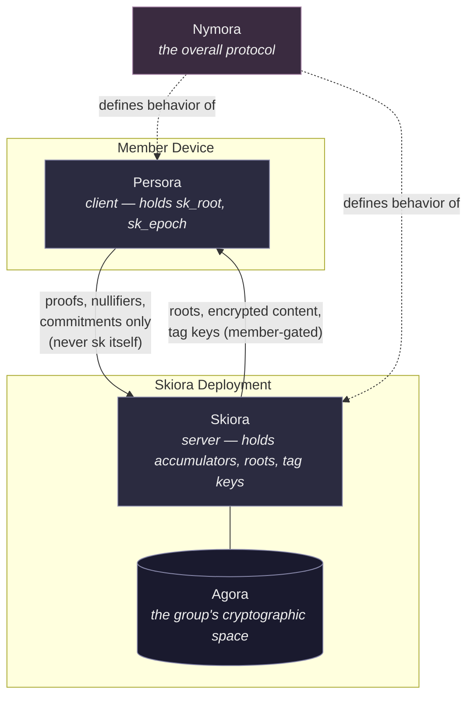
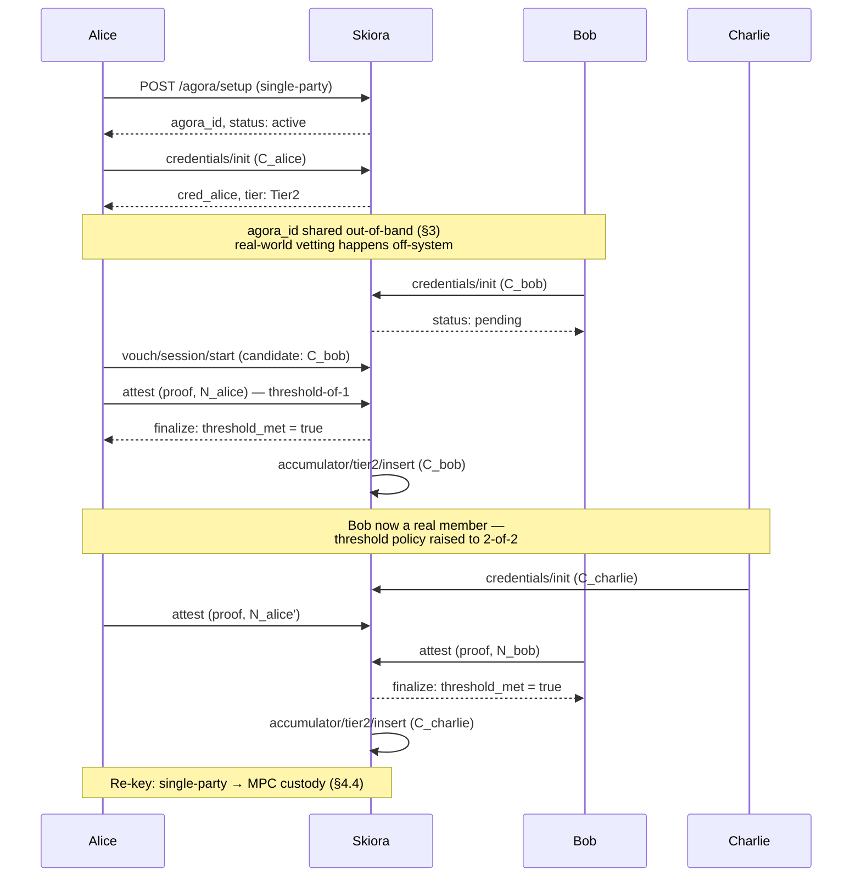
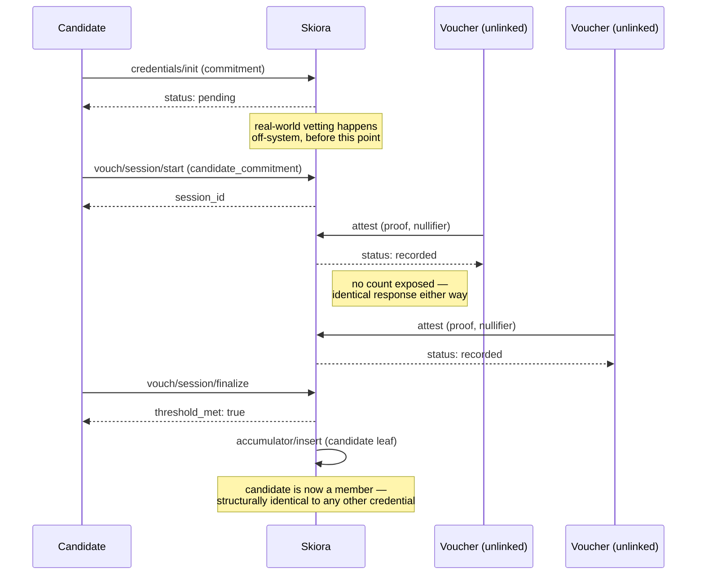
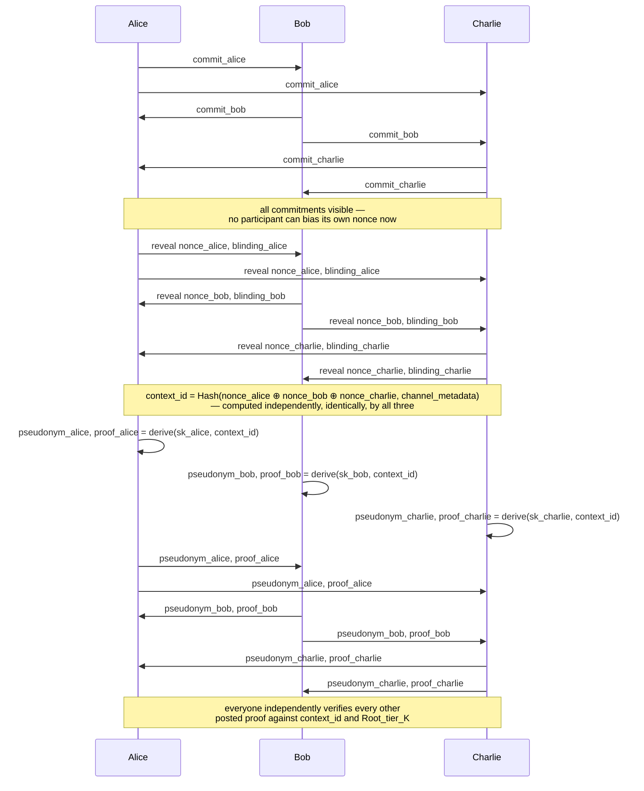
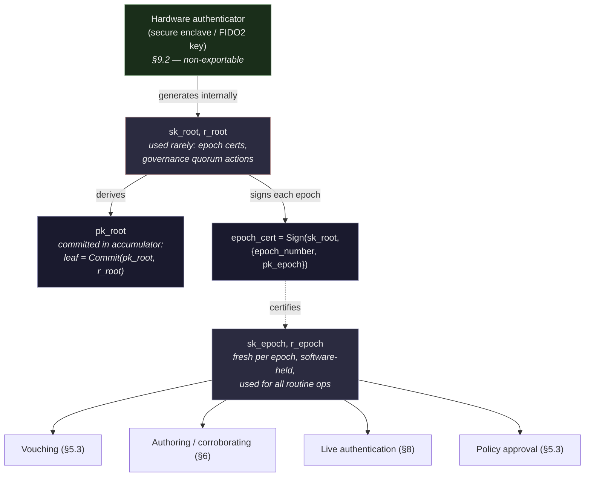
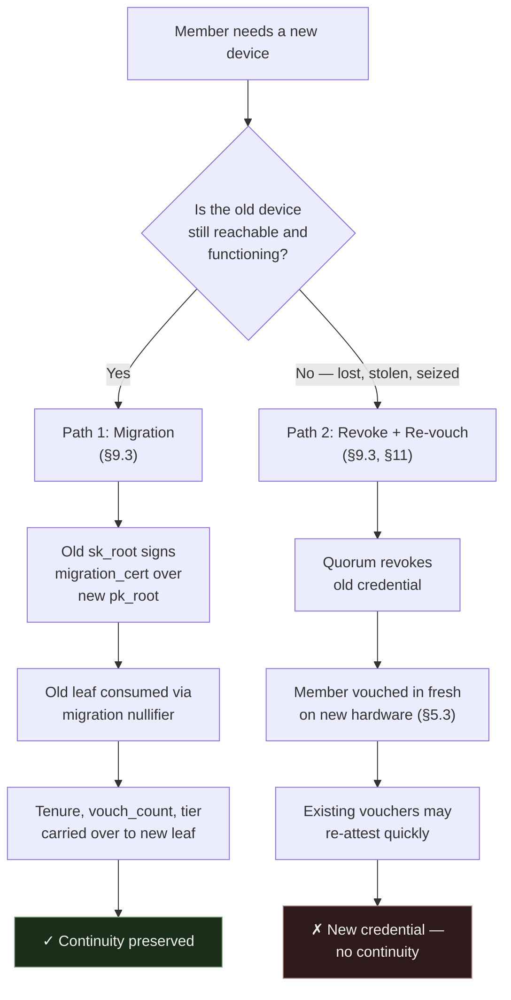

# Nymora Protocol Specification

**Status:** Design draft
**Scope:** Cryptographic architecture, API surface, mechanisms

Nymora lets a group of people organize, admit new members, and publish content
anonymously, authentically, and with provable dissolution. This document is the
**normative specification** — the mechanisms a conformant **Skiora** (server) and
**Persora** (client) implementation must follow.

Read alongside:

- **[threat-model.md](threat-model.md)** — §1 (purpose, adversary model) and §15 (known
  limitations). Start there for *what this design does and does not solve*.
- **`../tests/`** — conformance vectors, the executable form of this specification.

> **Section numbers are stable identifiers.** They are cited from source code and from the
> other documents (e.g. `§6.5`, `§9.2`). Numbering is preserved across the split into
> `nymora-protocol.md` and `threat-model.md` — **never renumber sections.** Append new
> ones instead.

---

## 2. Core Vocabulary

| Term | Meaning |
|---|---|
| **Nymora** | The overall protocol/system. |
| **Agora** | One instance of a group's private, tiered space. Fully independent cryptographic domain. |
| **Skiora** | The running deployment that actually holds and operates an agora's cryptographic material — credentials, accumulators, tag keys, key ceremonies, dissolution logic. Self-hosted or run by a chosen operator; not tracked by any external registry. |
| **Persora** | The client application — web or native — that a member uses to hold their credential, generate proofs and pseudonyms, and interact with an agora's Skiora. The "mask" a member wears when presenting themselves anonymously. |
| **`agora_id`** | Opaque, self-generated identifier for an agora — derived from its own public key material, not issued or tracked by any external party. |
| **Tier** | A membership level within an agora, gating access to content and privileges. |
| **Credential** | A member's anonymous, attribute-bearing cryptographic identity within one agora. |
| **Accumulator** | A Merkle tree whose root represents the current set of valid entries (members, voucher-eligible members, etc.) for a policy class. |
| **Nullifier** | A per-context deterministic hash derived from a member's secret key, used to enforce distinctness (no double-vouching, no double-attesting) without revealing identity. |
| **Attestation** | A zero-knowledge proof that a valid credential authored or corroborated a specific piece of content. |
| **Tag** | An opaque routing value letting a member locate which agora/epoch a piece of content belongs to, without transmitting the agora's identity in the clear. |
| **Transparency log** | An optional, per-agora, independently-replicated append-only log of identity-free state commitments (roots, policy changes, revocation-set root, pinned ledger heads), enabling any outside party to verify the machinery is run honestly without membership or identity access. |
| **Receipt ledger** | A per-Persora hash-chained, append-only record of every action a credential takes, replayable by another Persora to confirm the client's history is complete, consistent, and non-forged. |

### 2.1 System relationships



Nymora is the protocol these components jointly implement — it has no independent runtime existence of its own. A member's Persora never transmits `sk_root` or `sk_epoch`; only proofs, nullifiers, and one-time commitments cross the boundary to Skiora, which in turn never learns which credential produced any given proof.

---

## 3. No Registry — Agoras Are Self-Contained

There is no commercial or administrative third party anywhere that knows an agora exists, who owns it, or when it was created or dissolved.

An agora is instantiated directly:

```
POST /agora/setup
  body: { key_ceremony_mode }
  → { agora_id, status: "active" }
```

`agora_id` is derived deterministically from the agora's own initial public key material (e.g., a hash of its public parameters) — there is no external party handing it out. Discovery of an agora's existence and its `agora_id` happens entirely out-of-band, through direct communication between people who already trust each other, never through any directory, lookup service, or search capability.

**Rationale:** any third party that tracks agora existence, even one that never touches cryptographic material, is a single legal/technical target whose compromise or compulsion reveals metadata (existence, ownership, timing) this design is specifically built to avoid creating. Removing it entirely, rather than trying to harden it, closes that class of risk structurally.

**Cost:** no one-click provisioning, no professional operator handling hosting/billing on the group's behalf. Whoever needs an agora must stand up or arrange for operational infrastructure themselves. This friction is an accepted, and for the highest-threat groups a necessary, tradeoff.

---

## 4. Bootstrap: Single-Founder Admission

A single founder stands up the agora, and every subsequent member — including co-founders — is admitted through the *exact same* vouching code path used forever after.



### 4.1 Founder creates the agora alone

```
POST /agora/setup
  body: { key_ceremony_mode: "single-party" }
  → { agora_id, status: "active" }

POST /agora/{agora_id}/credentials/init
  body: { commitment: C_alice }
  → { credential_id: cred_alice, tier: "Tier2" }
```

This is a known, temporary weak window: for a short period, Alice alone holds the master key material. There is no way around this for a single founder — it is the accepted cost of avoiding a multi-party bootstrap ceremony.

### 4.2 Founder vouches the second member in — necessarily threshold-of-1

```
POST /agora/{agora_id}/vouch/session/start
  body: { candidate_commitment: C_bob, target_policy_class: "Tier2" }
  → { session_id }

POST /agora/{agora_id}/vouch/session/{id}/attest
  body: { proof: attest_proof_alice, nullifier: N_alice }
  → { status: "recorded" }

POST /agora/{agora_id}/vouch/session/{id}/finalize
  → { threshold_met: true, credential_update_token }
```

Someone has to be first; a threshold-of-1 admission is an unavoidable structural fact of any bootstrap. This is the *only* special case in the entire admission history of the agora.

### 4.3 Third and later members vouched at increasing threshold

```
POST /agora/{agora_id}/policy/tier2/propose
  body: { new_predicate: "threshold=2" }
POST /agora/{agora_id}/policy/tier2/proposal/{id}/approve   (each existing member)
POST /agora/{agora_id}/policy/tier2/proposal/{id}/activate
  → { policy_version: 2 }
```

Charlie, Dave, and all future members are vouched in via the identical 2-of-N (or higher) threshold flow. No credential anywhere in the agora carries a "founder" flag or distinct issuance type — every credential is structurally indistinguishable, differing only in the unavoidable fact of when it entered the accumulator.

### 4.4 Re-key to multi-party custody

Once enough real members exist, the agora re-keys from single-party to threshold (MPC) custody, closing the founder's-sole-custody window:

```
POST /agora/{agora_id}/key-ceremony/rekey-init
  auth: quorum of current members
  → { rekey_session_id }

POST /agora/{agora_id}/key-ceremony/rekey-{id}/complete
  → { status: "rekeyed", old_key_destroyed: true }
```

From this point forward, no single member — including the founder — can unilaterally reconstruct the master key or unilaterally dissolve the agora.

---

## 5. Membership and Vouching

### 5.1 Credentials

Each credential is an anonymous, attribute-bearing object (BBS+-style signature or equivalent) held privately by its owner:

```
credential = {
  tier: <hidden attribute>,
  vouch_count: <hidden attribute>,
  tenure_start: <hidden attribute>
}
```

Attributes are provable in zero knowledge (e.g., "tier ≥ 2", "tenure ≥ 6 months") without revealing exact values, and — critically — **without revealing relative ordering or comparison against any other credential.** No API exposes "which credential is oldest" or "how many vouches does X have relative to Y." Thresholds themselves can optionally be evaluated by a Proof Generation service so that even the credential holder never learns the exact numeric policy constants, only a binary grant/deny.

### 5.2 Accumulators

Each policy class (e.g., "Tier2 members," "Tier2-eligible vouchers") has its own Merkle accumulator, publishing only a root hash:

```
GET /agora/{agora_id}/accumulator/{policy_class}/root   [member-gated — see §7]
  → { root_at_epoch }
```

**No API surface exposes accumulator size, leaf count, or leaf listing, at any point.** Only the root hash is public (or member-visible, per §7); a fixed-depth tree's root reveals nothing about occupancy on its own.

### 5.3 Vouching protocol

Admission of a new candidate requires k-of-n independent zero-knowledge attestations from existing eligible members:

```
POST /agora/{agora_id}/vouch/session/start
  body: { candidate_commitment, target_policy_class }
  → { session_id }

POST /agora/{agora_id}/vouch/session/{id}/attest
  body: { proof, nullifier }
  → { status: "recorded" }     ← no running count, ever

POST /agora/{agora_id}/vouch/session/{id}/finalize
  → { threshold_met: true, credential_update_token }
```

Each attestation proof demonstrates, in zero knowledge:

```
∃ sk, r, merkle_path such that:
  Commit(sk, r) is a leaf in Root_voucher_eligible_{tier}
  ∧ nullifier = Hash(sk, session_id)
```

**The "ring" of possible signers is never an explicit list transmitted anywhere** — it is implicitly defined by the accumulator's root. A verifier learns only that *some* valid leaf produced the proof.

**Distinctness enforcement:** the verifier rejects duplicate nullifiers within a session, preventing one credential from being counted twice toward a threshold, without ever learning whose credential it was.

**No incremental disclosure:** `attest` calls return only `{status: "recorded"}`. The threshold outcome is revealed exactly once, at `finalize`. This closes a real timing-correlation channel — an observer watching a running counter tick 0→1→2 in real time could correlate individual attestation timestamps against other signals (e.g., who was active when) even without learning identity from the proof itself. Collapsing all intermediate state into a single, one-time disclosure removes that channel.



### 5.4 Anonymity-set size is not padded

Accumulators are not seeded with decoy ("chaff") entries to artificially inflate the apparent membership pool. Where a small real membership makes the anonymity set weak, that is an inherent limit of the group's size rather than something padding meaningfully repairs (see §15).

---

## 6. Content Provenance and Attestation

### 6.1 Authoring

A member authoring content `M` generates a message-bound attestation:

```
message_hash = Hash(M)

POST /agora/{agora_id}/proofs/message-attestation
  body: { message_hash, target_policy_class }
  → { attestation_proof, nullifier: N_msg }
```

The proof is bound to `message_hash` via the Fiat-Shamir challenge, so it cannot be detached and reattached to different content. `N_msg = Hash(sk, message_hash, agora_id)` is namespace- and message-bound, preventing replay across agoras or across different content.

**No persistent authorship pseudonym is included in the externally-shared bundle.** A stable, per-author identifier would be exactly as recognizable to an outside observer collecting multiple pieces of content as it would be to a legitimate member — recognition and linkability are the same property viewed from two angles. There is no way to grant outsiders zero linkage while granting members full linkage using a single shared field, so no such field exists in the external bundle.

### 6.2 Group-scoped reputation

**Individual authorship reputation is a member-only concept; externally, only group-level attestation exists.**

- **Externally**, every attestation proves only "a valid Tier-K+ member of this agora stands behind this content" — undifferentiated between authors, with no persistent field of any kind carried across posts. Two pieces of content from the same author are, to an outside observer, structurally unrelated.
- **Internally**, members may optionally track recurring-author reliability using a separate continuity mechanism (a zero-knowledge proof of "this pseudonym derives from the same secret as a prior one"), generated and checked only within member-only tooling, and **never serialized into anything that leaves the agora**. This is a stronger guarantee than access-controlling a shared field — the linking information is never transmitted externally at all, regardless of what keys an adversary might someday obtain.

### 6.3 Corroboration

Other members may independently attest to the same content:

```
POST /agora/{agora_id}/proofs/message-attestation
  body: { message_hash, target_policy_class, role: "corroboration" }
  → { attestation_proof, nullifier: N_msg }
```

Nullifier-distinctness (`N_msg` bound to the corroborator's own secret key) prevents one member faking multiple independent corroborations under different guises. **Corroboration carries no persistent pseudonym at all.** A stable per-corroborator identifier would let an observer collecting many corroborated posts over time build a co-occurrence table (which corroborators repeatedly appear alongside which authors), reconstructing a social proximity graph even without ever breaking individual anonymity. Every corroboration event is single-message-scoped and mutually unlinkable across posts, closing this.

### 6.4 Routing without exposing agora identity

Content bundles must let a member determine which agora and epoch to verify against, without transmitting `agora_id` in the clear (a plaintext identifier would let any observer confirm group affiliation for tagged content without needing to break any proof).

```
tag = HMAC(K_tag_e, message_hash)
```

`K_tag_e` is a symmetric key specific to one agora and one epoch, distributed only to current members via the agora's attribute-based-encryption (ABE) content-gating mechanism — the same mechanism used to gate tiered content generally. A member resolves a tag by trying their own held `K_tag_e` values (bounded to recent epochs they hold keys for):

```
for e in recent_epochs_member_has_keys_for:
  if HMAC(K_tag_e, message_hash) == tag: match — proceed to fetch root_at_epoch_e
```

`tag` is a fixed-size (e.g., 32-byte) HMAC output — computationally indistinguishable from random to anyone without the key. It carries no visible structure, length variation, or label.

Revocation of tag access follows automatically from the existing ABE-gating mechanism: a revoked member simply stops receiving future `K_tag_e` broadcasts.

### 6.5 The `attestation_proof` object

A fixed-shape, non-interactive zero-knowledge proof (e.g., Groth16/PLONK), using **one standardized circuit shared across every agora** — deliberately, so that proof size and structure never vary by agora, preventing proof-shape fingerprinting from correlating content back to a specific group.

```
Statement proven:
  ∃ sk, r, merkle_path such that:
    Commit(sk, r) ∈ Root_{policy_class}
    ∧ nullifier = Hash(sk, message_hash, agora_id)
    ∧ Fiat-Shamir challenge incorporates message_hash
```

On the wire: a small, fixed-size proof blob plus `message_hash` and `nullifier`. No `agora_id` or root value is transmitted as a labeled field in the bundle — a verifier resolves both out-of-band via the tag mechanism (§6.4) before checking the proof.

### 6.6 Full external bundle format

```json
{
  "content": "<M>",
  "tag": "<32-byte HMAC output>",
  "attestation": {
    "proof": "<fixed-size SNARK blob>",
    "message_hash": "<Hash(M)>",
    "nullifier": "<32-byte value>"
  },
  "corroborations": [
    { "proof": "...", "nullifier": "..." }
  ]
}
```

No `agora_id`, no root, no epoch marker, no pseudonym of any kind is present. Everything a verifier needs beyond this bundle comes from material the verifier already independently and legitimately holds as a member.

---

## 7. Verification

Verification is restricted to members: only someone who can prove their own current standing in the agora can obtain the root needed to check an attestation.

```
POST /agora/{agora_id}/proofs/policy-check
  body: { proof_token, encrypted_attributes, target_policy_class }
  → { grant_token }

POST /agora/{agora_id}/accumulator/{policy_class}/root-at-epoch
  auth: grant_token
  body: { epoch }
  → { root_at_epoch }
```

A non-member possessing an attestation bundle, even with a correct guess at the content, has no path to a trustworthy root and cannot complete verification.

The two calls can be consolidated into a single authenticated round-trip:

```
POST /agora/{agora_id}/verify
  auth: verifier's membership proof
  body: { attestation_proof, message_hash, epoch_hint }
  → { valid: true }
```

Because a member must prove standing before receiving a root, verification is an online operation requiring live contact with Skiora — consistent with Skiora already being relied upon for root distribution, tag-key distribution, and content gating.

---

## 8. Live Mutual Authentication

Sections 5–7 cover *asynchronous* proof: vouching, content attestation, and verifying published material after the fact. A separate, related problem is **live authentication** — when two or more members are actively communicating (a direct message, a voice call, a group channel) and need to confirm, in real time, that everyone present genuinely (a) holds a credential vouched into the agora, and (b) actually possesses the secret key behind it, rather than replaying or relaying someone else's proof.

This is a distinct primitive from content attestation. A static `attestation_proof` only proves "at some past epoch, some valid credential attested to some message" — it says nothing about who is on the other end of a conversation *right now*, and a captured proof could in principle be replayed by an impersonator. Live authentication needs freshness and mutual commitment that content attestation doesn't require.

### 8.1 Jointly-derived session context (n participants)

The mechanism applies uniformly to any live exchange between two or more members — a direct message, a call, or a group channel — and reuses the pseudonym-derivation and ZK-membership-proof machinery already defined for content attestation (§6), rather than introducing a new primitive.

**Step 1 — every participant posts a commitment:**
```
commit_i = Hash(nonce_i, blinding_i)   for each participant i = 1..n
```

**Step 2 — once all commitments are visible, everyone reveals:**
```
reveal nonce_i, blinding_i
```

**Step 3 — the shared context is derived from all contributions together:**
```
context_id = Hash(nonce_1 ⊕ nonce_2 ⊕ ... ⊕ nonce_n, channel_metadata)
```

**Step 4 — each participant posts one pseudonym and proof against the shared context:**
```
pseudonym_i = Hash(sk_i, "conversation", context_id)
proof_i = ZK(membership ∧ pseudonym_i correctly derived)
```

**Step 5 — everyone independently verifies every posted proof** against the same `context_id` and the current `Root_tier_K`.

Because `context_id` depends on nonces contributed by *every* participant, and all commit before any reveal, no single party can precompute a pseudonym in advance or bias the final context toward one they've already prepared a replay against. This scales as O(n) — one proof per participant, checked once against a single shared value — rather than the O(n²) exchanges a pairwise-only design would require for every participant to mutually authenticate with every other. At n=2, the mechanism reduces to ordinary two-party mutual authentication with no special-casing required.

**channel_metadata** should ideally incorporate something from the underlying secure channel's own key exchange (e.g., a hash of the session's ephemeral Diffie-Hellman output), so that the resulting `context_id` inherits whatever anti-relay guarantee that channel's handshake already provides. The pseudonym scheme is only as strong as the channel it's bound to — it does not independently defend against a person-in-the-middle relaying two separate sessions unless the underlying channel already resists that.



**Sybil detection within a session:** because `pseudonym_i` is deterministic given `sk_i` and `context_id`, the same credential posting twice under two apparently distinct pseudonyms in the same session produces an identical value both times — an immediately visible duplicate, without anyone learning whose credential it was.

**Late joiners:** since `context_id` is fixed once the joint commit-reveal round completes, someone arriving after that round cannot cleanly contribute a nonce into an already-finalized value. Practical handling is to periodically re-run the commit-reveal round (e.g., every N minutes) so late arrivals are incorporated at the next refresh, rather than treating context establishment as a one-time event for the life of a long-running channel.

### 8.2 Thread/session continuity

If `context_id` is scoped to persist for the life of a conversation (rather than re-derived per message), the same `pseudonym_i` recurs across every message in that thread — giving "this is still the same counterpart as before" continuity within a single conversation, for free, without any separate mechanism. This pseudonym does not carry over to any other conversation, to the agora's authorship pseudonym (§6.2), or to any other context — each is independently derived and mutually unlinkable.

### 8.3 In-person authentication

The protocol in §8.1 assumes a network channel to bind `context_id` against. In an in-person meeting, that binding has to come from somewhere else, and connectivity to the Skiora may not be available at all during the gathering. The same commit-reveal-derive structure applies, with two adaptations: local transport for the nonce exchange, and a human-verified check as the actual defense against a manipulated session context. All cryptographic operations described below — generating commitments, deriving `context_id`, producing proofs and pseudonyms — are performed by each participant's Persora client, running on whatever device they've brought.

**Local transport instead of network transport.** Commitments and reveals are exchanged Persora-to-Persora via QR code, NFC, or proximity-bounded Bluetooth rather than over a network:

```
commit_i = Hash(nonce_i, blinding_i)   → displayed/scanned as QR or tapped via NFC
```

Every participant's Persora collects every other participant's commitment, then reveals follow the same way. `context_id` is derived identically to the network case — only the transport carrying the nonces changes.

**Short Authentication String (SAS) as the relay defense.** Proximity transport alone does not fully rule out relay (a commitment could in principle be photographed and forwarded to a confederate elsewhere). The actual defense — the same technique underlying Signal's safety numbers and ZRTP/Bluetooth secure pairing — is to have each participant's Persora compute and display a short digest of the finalized `context_id`:

```
SAS = short_digest(context_id)   // e.g., a 6-digit code or short emoji sequence
```

Every participant reads their Persora's SAS aloud, or holds it up, and the group confirms all codes match before trusting the session. If any participant's `context_id` was manipulated — for instance, by a relayed or substituted nonce from someone not actually in the room — that Persora's SAS will not match the others, and the discrepancy is caught immediately by the people present, rather than depending on any cryptographic transport guarantee. This is a case where the human verifier is the strongest available check, precisely because it does not rely on trusting the channel at all.

**Group meeting sequence:**
1. Every participant's Persora generates and displays a commitment (QR/NFC).
2. Every participant collects every other participant's commitment.
3. Reveals are exchanged the same way once all commitments are collected.
4. Each Persora independently computes `context_id` from all contributions.
5. Each Persora displays a SAS; the group verbally or visually confirms all codes match before proceeding.
6. Each participant's Persora derives `pseudonym_i` and `proof_i` against the confirmed `context_id`, displayed locally (QR or shared screen) for others to check.

**Offline verification requires pre-cached roots.** Checking `proof_i` against `Root_tier_K` normally means a live, member-gated fetch from the Skiora (§7) — often unavailable in a location chosen for an in-person meeting under this threat model. The practical mitigation is for each participant's Persora to fetch and cache the current root (and a reasonable span of recent epochs) while still online, before the meeting, so that verification during the gathering is done entirely from local, pre-fetched material with no network dependency at all. This is arguably a security improvement in its own right, since it means the meeting itself generates no live network traffic to correlate.

**Revocation staleness.** Revocation status (§11) generally does require live connectivity to be current. A member revoked shortly before the meeting, with no participant's Persora having synced since, will not be caught by an offline, pre-cached check. In-person authentication under this design should be understood as confirming "was a valid member as of my last sync," not "is definitely still valid this instant" — worth weighing accordingly against an online authentication, which can check revocation status live.

### 8.4 What this establishes, and what it doesn't

**Establishes:** everyone actively present in this specific live exchange holds a real, currently-valid credential in the agora, confirmed freshly for this session — not a stale, revoked, or replayed proof, and not a relayed impersonation, provided either the underlying network channel resists relay/person-in-the-middle attacks (§8.1) or, for in-person settings, the group's SAS comparison catches any manipulated session context (§8.3).

**Does not establish:** which specific person a given pseudonym corresponds to — the same anonymity guarantee as everywhere else in this design. It also does not, by itself, protect against the observation that a live vouching/authentication exchange happened, at this time, on whatever channel or platform hosts the conversation (e.g., a third-party chat platform can see that commitments and proofs were posted, even though it learns nothing about identity from their content), and for in-person authentication specifically, it does not guarantee revocation status is fully current if participants verified from pre-cached, offline material (§8.3) — consistent with the standing limitation that network- and platform-level metadata, and connectivity-dependent freshness, sit outside what this design's cryptography alone can guarantee (§15).

## 9. Key Hierarchy, Hardware-Backed Custody, and Device Migration

The design so far has referred to "`sk`" as a single secret held by Persora. In practice, treating a member's entire cryptographic standing as one flat, always-resident secret creates two compounding risks worth addressing directly: a single device compromise exposes a member's *entire* past and future activity at once, and there is no way to change devices without becoming, cryptographically, an entirely new person. This section defines a key hierarchy and custody model that bounds both.

### 9.1 Root key and epoch keys

Rather than one flat `sk`, each member's credential is split into two tiers:

```
sk_root   — committed (via its public counterpart) in the agora's accumulator; used rarely
sk_epoch  — freshly derived each epoch; used for routine, day-to-day operations
```

The accumulator leaf commits to `pk_root` (a public verification key derived from `sk_root`), using an opening value `r_root` fixed once at credential creation:

```
leaf = Commit(pk_root, r_root)
```

`sk_root`'s only routine job is to **certify a new epoch key** when one is generated:

```
epoch_cert = Sign(sk_root, {epoch_number, pk_epoch})
```

Every ordinary proof — vouching, authoring content, corroborating, live authentication (§8) — uses `sk_epoch`, together with `epoch_cert`, inside a single zero-knowledge proof that checks the whole chain without ever exposing `pk_epoch` or the certificate as plaintext:

```
∃ sk_epoch, r_epoch, pk_epoch, epoch_cert, merkle_path such that:
  epoch_cert verifies as a valid signature over pk_epoch, by some pk_root committed in Root_tier2
  ∧ r_epoch is correctly derived for this credential and epoch
  ∧ nullifier = Hash(sk_epoch, message_hash, agora_id)
```

`pk_epoch` is a **private witness only** — it is never transmitted as a public input alongside a proof. Making it public would reintroduce exactly the kind of same-epoch cross-post linkability this design closed for authorship (§6.2) and corroboration (§6.3): every attestation in a given epoch would otherwise share an identical, comparable `pk_epoch` value, letting an observer link them without needing any other pseudonym field. Folding certificate verification entirely inside the proof keeps the output a single bit — `valid: true/false` — consistent with every other proof in this design (§6.5).

**What this bounds:** if `sk_epoch` is compromised, the attacker can forge nullifiers and impersonate the member only for that one epoch — including retroactively recomputing that epoch's own past nullifiers, since `Hash(sk_epoch, context)` is deterministic. Prior epochs' keys have already been discarded and cannot be reconstructed from the current one, so past activity outside the compromised epoch stays unlinkable even to someone holding the current key. This is the same forward-secrecy principle behind ratcheting message keys, applied here to credential-derived nullifiers.

**What this does not bound:** compromise of `sk_root` itself. Since `sk_root` can sign arbitrary future epoch certificates and is the credential authorized to participate in root-level governance actions (quorum votes, re-keying, dissolution — §5.3, §12), its compromise is effectively total and permanent for that credential, which is precisely why `sk_root` deserves the heavier protection described next, rather than living alongside `sk_epoch` in the same routinely-used storage.

**The commitment-opening value `r` is rotated on the same schedule as `sk_epoch`, not held static for the credential's lifetime.** Every proof of root-leaf membership requires `r` as a witness alongside `sk_root` — a static, unrotated `r_root` reused across every proof for the credential's entire lifetime would carry the same exposure profile as `sk_root` itself, but without any of `sk_root`'s hardware protection (§9.2), since `r` has no independent reason to be treated as sensitive and would otherwise sit in ordinary Persora storage indefinitely. To avoid this asymmetry, `r_root` is never resupplied directly by routine proofs. Instead, an epoch-scoped opening value is derived the same way `sk_epoch` is:

```
r_epoch = KDF(r_root, epoch_number)
```

Routine proofs (vouching, authoring, corroborating, live authentication, policy approval) use `r_epoch` as the membership-inclusion witness rather than `r_root` directly, exactly mirroring how they use `sk_epoch` rather than `sk_root`. A compromise of `r_epoch` is bounded to the epoch it was derived for, consistent with the compromise bound already established for `sk_epoch` — a leaked `r_epoch` does not expose `r_root`, and does not extend the exposure window beyond the epoch in which it was used. `r_root` itself, like `sk_root`, is touched only during epoch rollover (to derive the next `r_epoch`) and governance actions, and should receive equivalent protection — ideally held alongside `sk_root` in the same hardware-backed custody described in §9.2, rather than left in ordinary app storage where a device compromise could recover it independently of `sk_root`.



Compromise of `sk_epoch`/`r_epoch` (the pair touched by every routine operation) is bounded to one epoch. Compromise of `sk_root`/`r_root` (touched only rarely, and ideally hardware-bound per §9.2) is total and permanent for that credential — which is exactly why the two pairs are never stored or used together.

### 9.2 Hardware-backed custody of the root key

`sk_root` is used rarely (epoch rollover, governance quorum actions) and is catastrophic if exposed — exactly the profile suited to hardware-backed key custody rather than ordinary app-managed storage.

**Mechanism.** Persora delegates generation and use of `sk_root` and `r_root` to a hardware authenticator — a phone's secure enclave (Apple Secure Enclave, Android StrongBox), a discrete security key (YubiKey-class), or an equivalent FIDO2/WebAuthn-compatible element. The authenticator generates both values internally, using its own random number generator; neither leaves the hardware in any form, encrypted or otherwise. Persora holds only a reference to the hardware-resident key material and requests operations from it:

```
Persora → authenticator: "generate a new keypair and opening value scoped to agora_id X"
authenticator → Persora: pk_root   (sk_root and r_root never leave the secure element)

Persora → authenticator: "sign this epoch-certificate payload; derive r_epoch"
authenticator → prompts for biometric/PIN (user-presence check)
authenticator → Persora: signature bytes, r_epoch
```

**Per-agora scoping is native to this pattern.** WebAuthn/FIDO2 authenticators already generate a distinct, unrelated keypair per relying-party context by design — treating each `agora_id` as its own relying-party identifier means "one unlinked root credential per agora" (a requirement already established in §5.1) is enforced by the hardware's own architecture, not solely by Persora's own software discipline.

**`sk_epoch` and `r_epoch` remain software-managed.** Given how frequently they are used (every vouch, post, corroboration, and live-authentication event), requiring a hardware user-presence prompt for every single operation would be impractical. Both are generated and held by Persora in ordinary (ideally still OS-level-protected, e.g., platform keychain) storage, accepting the bounded, epoch-scoped exposure described in §9.1 as the practical tradeoff for usability.

**What this defends against, precisely.** Hardware-backed custody closes the most common real-world compromise path: malware or a compromised app silently reading a key out of accessible storage. Secure elements are specifically engineered to resist this, and resisting casual forensic extraction from a seized, locked device is an explicit design goal of most modern implementations.

**What this does not defend against, stated plainly.** A sufficiently resourced adversary with specialized hardware-attack capability (side-channel analysis, chip decapping, fault injection) can, in principle, still defeat some secure elements — hardware backing raises this bar substantially but does not make it absolute, and claiming otherwise would overstate the guarantee. More importantly: hardware custody does nothing against **coercion**. If an adversary has physical control of both the device and its legitimate, present user (willingly or under duress), the hardware will perform whatever signing operation is requested, since "user presence verified" is exactly what coercion produces. This is consistent with the standing principle throughout this design that cryptography bounds what remote or silent compromise can achieve; it does not, and cannot, protect against a present and compelled legitimate user.

**Attestation tradeoff.** Hardware authenticators can optionally prove, cryptographically, that a key was genuinely generated in approved hardware rather than spoofed in software. If the agora's policy requires this, the attestation should be checked and consumed entirely inside a zero-knowledge proof at credential-registration time — never transmitted or stored as a raw, inspectable attestation certificate — since raw attestation data commonly reveals authenticator make/model and sometimes batch-level identifiers, which would introduce a new fingerprinting vector this design has otherwise worked to eliminate.

### 9.3 Device migration and lost-device recovery

A direct consequence of non-exportable, hardware-bound root keys: a device change, taken at face value, produces an entirely new, unlinked credential with no vouches, tenure, or history — cryptographically indistinguishable from a brand-new member. This is a genuine cost of eliminating extractability, not a minor edge case, and the design supports two distinct recovery paths, selected by whether the member's prior device is still reachable.

**Path 1 — planned migration (old device still reachable).** While the old device is still functioning and accessible, its `sk_root` signs a one-time migration certificate authorizing the transition to a newly generated key:

```
Old device: migration_cert = Sign(sk_root_old, {pk_root_new, agora_id})
New device: generates a fresh (sk_root_new, r_root_new, pk_root_new) internally, hardware-backed as in §9.2

POST /agora/{agora_id}/credentials/migrate
  body: { migration_cert, new_commitment: Commit(pk_root_new, r_root_new) }
```

The migration is verified (ideally itself wrapped in a ZK proof rather than transmitted with `pk_root_old` in the clear, consistent with this design's general avoidance of exposing linkable identifiers) against the old, still-valid leaf. On success, the agora's accumulator attributes — tenure, vouch count, tier — carry over to the new leaf, and the old leaf is consumed via a migration-specific nullifier, preventing a still-live old key from being used to spawn more than one successor credential.

**Path 2 — lost, stolen, or seized device (old device unreachable).** No migration certificate can be produced without the old key, so this path falls back to ordinary quorum-based revocation (§11) of the old credential, followed by fresh admission on new hardware via the standard vouching flow (§5.3). No continuity is preserved — this is the accepted cost when the old key genuinely cannot be reached. The group may choose to accelerate re-vouching for a known, previously-vouched member (existing vouchers can re-attest quickly, since the real-world trust judgment hasn't changed, only the cryptographic anchor), but the resulting credential is, structurally, new.

**Both paths coexist because they address disjoint situations, not competing designs.** Supporting migration alone leaves no recovery path for a genuinely lost or seized device. Supporting only revocation-and-re-vouch imposes a real, unnecessary continuity cost on the far more common case of routine, planned device upgrades. The correct behavior is for each situation to route to the path suited to it, determined by simple reachability of the old device at the time of transition.

**Policy judgment: how long to wait before presuming a device unreachable.** A member reporting a possibly-misplaced device creates an ambiguous window — wait, in case the device turns up and migration remains possible, or revoke immediately and let the member re-vouch if and when it's recovered. This is a genuine risk-tolerance decision best left to each agora's own trust-committee quorum policy (§5.3's policy-mutation mechanism already provides the tool to set and adjust this threshold), rather than a fixed value the protocol should impose uniformly across agoras with very different risk profiles.



## 10. Integrity and Auditability

The mechanisms so far protect against forged proofs and identity disclosure, but they do not, on their own, defend against two distinct classes of *rogue-actor* behavior: a **rogue Skiora** that silently rewrites or forks its aggregate state, and a **rogue Persora** that abuses its own valid credential or misrepresents its own history. These are separate trust boundaries and require separate mechanisms. This section defines three composing layers, each covering the party the layer below it must otherwise trust.

| Threat | Covered by |
|---|---|
| Rogue **Skiora** silently rewrites, rolls back, or forks aggregate state | §10.1 Per-agora transparency log |
| Rogue **Persora** hides, denies, or forks its own action history | §10.2 Personal receipt ledger + §10.3 head-pinning |
| Rogue **Skiora** secretly *permits* a Persora to fork its ledger | §10.1 (pinned heads are publicly checkpointed) |

None of these *prevent* a compromised client from taking a valid-but-unwanted action in the moment — that prevention belongs to hardware-bound authorization (§9.2) and structural server-side enforcement (§5.3). What this section adds is that such actions cannot afterward be **hidden, denied, or misrepresented**, and that a rogue operator cannot silently corrupt the shared state without public detection.

### 10.1 Per-agora transparency log

Each agora optionally publishes its integrity-critical state commitments to an **append-only, independently-replicated transparency log**, in the style of certificate transparency. The log lets any outside party — with no membership, content access, or identity information — verify that the agora's machinery is being run honestly.

**On the log (identity-free aggregate commitments only):**
- the sequence of accumulator roots per epoch (`Root_tier2_epoch_0, Root_tier2_epoch_1, …`) — already just hashes that reveal nothing about membership (§5.2);
- signed tree heads making the root sequence itself an append-only Merkle log, so a published root cannot later be swapped or deleted without breaking the log's hash chain;
- policy-change events (§5.3) as committed entries — *that* a policy changed at a given epoch, never who voted;
- the revocation-set root (§11), so revocation state is publicly consistent;
- pinned per-credential ledger heads (§10.3), so a rogue Skiora cannot secretly permit a client to fork its personal ledger.

**Never on the log:** nullifiers, attestation bundles, content, tags, individual membership commitments, or verification receipts tied to members. The line is aggregate, identity-free state commitments only; anything per-action or per-member stays off.

**What an independent auditor can verify** (holding only the public log):
1. **Non-equivocation** — Skiora serves one linear history, not a secretly forked view showing different roots to different members (a split-view attack).
2. **Append-only integrity** — no root was retroactively altered or deleted; a rogue actor cannot quietly roll back a revocation or un-dissolve an agora.
3. **Protocol conformance** — each state transition follows the rules (e.g., dissolution actually froze the roots; a claimed revocation actually appears in the revocation-set root).

The auditor learns *that the machinery is honest*, and nothing about membership, content, or identity.

**Requirements for the guarantee to hold:**
- The log must be **independently operated or replicated** — a log Skiora alone hosts is worthless, since Skiora could fork it too. This reintroduces a narrow infrastructure dependency, but a far smaller one than a registry: the log is purely append-only and identity-free.
- **Gossip is required** — split-view detection only works if independent auditors compare their views of the log. The guarantee is "a rogue Skiora is caught *if* independent auditors gossip," not "caught unconditionally."

**Existence-privacy tradeoff:** publishing per-agora roots reveals that an agora exists and its rough activity cadence, which conflicts with §3's existence-hiding. The transparency log is therefore **opt-in per agora** — appropriate for agoras that prioritize provable honesty over hiding their own existence, and declined by agoras that need maximal existence-privacy. Where existence-privacy matters but some auditability is still wanted, roots may be pooled across agoras without per-agora labels, letting an auditor confirm the pooled log is append-only and consistent without isolating one agora's history.

### 10.2 Personal receipt ledger

Each Persora maintains a **hash-chained, append-only ledger of every action its credential takes** — vouching, attestation, verification, governance participation. Each entry commits to the previous one, making the whole history tamper-evident:

```
entry_n = {
  action:        vouch | attest | verify | governance_vote | ...,
  payload_hash:  Hash(what was signed or verified),
  epoch:         e,
  prev_hash:     Hash(entry_{n-1}),
  signature:     Sign(sk_epoch, {action, payload_hash, epoch, prev_hash})
}
```

A second Persora — chosen by the member, or verifiably-randomly selected (§10.4) — can **replay** this ledger: recompute the chain, check every signature, and confirm the history is internally consistent and genuinely produced by that credential. This turns "the client's account of its own actions" from *trust-me* into *verifiable*, and specifically:

- a rogue Persora cannot silently rewrite its own past once an entry is witnessed;
- **verification receipts are ledger entries** — a replaying Persora re-runs each logged verification against the logged root and confirms the claimed result, catching a client that lied about a verification outcome, with the lie now pinned in a signed chain rather than an ephemeral claim;
- the legitimate user (or their next device after migration, §9.3) can replay their *own* ledger and check that every action is one they actually authorized — converting silent key-abuse into detectable key-abuse, feeding fast revocation (§11).

The ledger records abuse faithfully; it does not prevent it. A compromised Persora that vouches for a malicious candidate writes a truthful entry saying so — detection and accountability, not prevention.

### 10.3 Enforced logging and head-pinning

A tamper-evident chain only proves the entries *in it* are consistent; it says nothing about entries never written. A rogue Persora could therefore keep two sets of books — a clean "show" ledger and a real hidden one — unless logging is *enforced*. Skiora provides that enforcement:

- **Skiora refuses any action not accompanied by its chain-extending ledger entry.** Every vouch, attestation, or governance submission must carry the new entry's hash and its `prev_hash`. A rogue Persora cannot perform an unlogged action, because Skiora will not process it.
- **Skiora pins the latest committed ledger head** for each credential (identified only by an unlinkable per-epoch handle — §10.4). It accepts only entries extending the single head it last recorded, so a divergent second chain references a `prev_hash` Skiora does not recognize as current and is rejected. This makes the ledger both *complete* (every action is in it) and *non-forkable* (one chain per credential).

Because head-pinning relies on Skiora following the "one non-forked chain per credential" rule, a rogue Skiora could in principle permit a fork — which is why the **pinned heads are themselves checkpointed to the transparency log (§10.1)**. A rogue Skiora that secretly allows a client to fork its ledger is caught by the same public non-equivocation audit. Each layer covers the party the one below it must trust:

- **Personal receipt ledger** → a client cannot misrepresent its own history.
- **Skiora head-pinning** → a client cannot keep secret books or fork.
- **Transparency log** → a rogue Skiora cannot secretly permit a fork.

### 10.4 Keeping the ledger from becoming an activity graph

A per-credential chain that Skiora pins, with heads published to a log, risks becoming exactly the per-member activity graph the rest of the design avoids — "this credential took 47 actions at these epochs" is a linkable profile even without a name attached. Two constraints keep it private:

- **The head-pinning handle rotates per epoch.** What Skiora pins is an unlinkable, per-epoch commitment, not a stable identifier — so Skiora cannot stitch a credential's activity into one long thread across epochs, nor read chain length or cross-epoch continuity from the heads it holds. The chain itself remains continuous and is known in full only to the holder and to any replay-witness the holder involves; Skiora sees only rotating head commitments, never contents.
- **The ledger contents are holder-only.** The full receipt ledger is replayed by a second Persora the member chooses or that is verifiably-randomly selected (see selection below) — it is never handed to Skiora in full. Skiora sees head commitments; it never sees the actions those heads summarize.

**Verifiably-random selection of a replay-witness.** When a replay check is triggered rather than member-initiated, the second Persora must not be chosen at Skiora's discretion — a rogue Skiora would route checks to a colluding client, and selection would leak "this member was asked to re-verify at this time." Instead, selection uses public randomness Skiora cannot bias (the jointly-derived-randomness primitive from §8.1), and the selected witness proves in zero knowledge that it is the member the randomness selected, without revealing which member that is. Because verification and ledger-replay are deterministic, a disagreement between two witnesses is not resolved by voting but by **recomputation** — any honest party re-runs the deterministic check against the logged root, and the witness whose result does not match is the faulty one. The value of a second witness is catching a client that lies about a reproducible computation, not manufacturing consensus.

## 11. Revocation

Revocation must remove a compromised member's standing without exposing their identity, and — critically — must apply *retroactively* to a distinct fact from the original attestation.

**Two separate, non-conflated claims:**

1. **"Was this legitimately attested by a valid credential at the time?"** — a permanent historical fact. The original ZK proof cannot and should not be made to "stop being true" — it is a mathematical statement about the accumulator's state at a past epoch, unaffected by later events.
2. **"Is the credential behind this attestation currently in good standing?"** — a dynamic, evolving fact, checked separately.

```
POST /agora/{agora_id}/attestation/revocation-status
  auth: querying member's own credential proof
  body: { nullifier }
  → { author_status: "current" | "revoked" }
```

This requires the Skiora to maintain a private internal index from attestation-nullifiers to current credential status — checkable without ever revealing which credential produced a given nullifier, only its present standing.

**Scoping, by explicit design decision:** this status check is **internal-only**. It is never included in, or derivable from, anything shared outside the agora. Externally, the group's attestation remains permanent and unconditional — "the group vouched for this at the time" — regardless of later internal governance changes. This mirrors the group-vs-individual reputation scoping in §6.2: the external world receives a coarse, permanent, group-level fact; the internal community receives a finer-grained, evolving, member-level one.

**Consequence, stated plainly:** because external attestation is permanent and cannot be retroactively withdrawn, the group's external credibility is genuinely exposed to anything a member attested to before revocation. There is no cryptographic "undo" once content has propagated externally. The only real mitigations are upstream — careful vetting before admission, and fast internal detection leading to prompt revocation — not anything the protocol can clean up after the fact.

**Why revocation cannot depend on author cooperation:** requiring authors to periodically "refresh" a liveness proof fails precisely in the case that matters — a revoked or compromised author has no incentive to cooperate, and if they could still produce a valid refresh, revocation would be meaningless. The status check must therefore be something the group determines independently of the author's cooperation.

---

## 12. Dissolution

Dissolution must make an agora's cryptographic material **provably, irreversibly destroyed** — not merely marked inactive.

```
POST /agora/{agora_id}/dissolve/initiate
  auth: quorum of current trust-committee-eligible credentials
  → { dissolution_session_id }

POST /agora/{agora_id}/dissolve/{id}/confirm
  auth: individual member's credential proof
  body: { confirmation_signature }
  → { status: "recorded" }

POST /agora/{agora_id}/dissolve/{id}/execute
  [auto-triggered once quorum threshold met]
  → { status: "keys_destroyed", verifiable_destruction_proof }
```

With multi-party (MPC) key custody in place (per §4.4), dissolution is a genuine mathematical fact, not a promise: once enough key shares are independently destroyed that the reconstruction threshold can no longer be met, the master key is information-theoretically unrecoverable, regardless of what any remaining party does.

**Effects:** existing accumulator roots for the agora are frozen; no new attestations, admissions, or content can be produced; existing content ciphertexts become permanently undecryptable once the ABE master key is destroyed; historical attestation proofs remain checkable against their frozen root for as long as any member retains a cached copy, but Skiora's ability to serve new verifications for this agora ends.

**Quorum requirement, deliberate:** single-party dissolution risks both a coerced founder unilaterally destroying the agora and accidental/malicious unilateral action. Requiring quorum trades speed for safety-against-coercion — an explicit tradeoff the trust committee should set deliberately per agora, since a group facing an imminent, active threat may reasonably prefer a faster, lower-quorum emergency dissolution path than a lower-urgency group would.

---

## 13. Deployment Architecture

**One operator-side system, one client.** This is a clean client/server split, not a multi-party trust arrangement:

- **Skiora**: the server-side deployment. Holds all cryptographic material — credentials, accumulators, tag keys, content, dissolution logic. This is the only operator-side system that exists; there is no Registry, no billing layer, and no administrative tracking of agora existence anywhere.
- **Persora**: the client. Runs on each member's own device (web or native), holds the member's private credential material locally, and performs all proof generation, pseudonym derivation, and root/content verification on the member's behalf. Persora never transmits a member's secret key anywhere — only the zero-knowledge proofs and derived values described throughout this document.

Whoever operates a given agora's Skiora — self-hosted by the group, or a chosen service provider — is a decision each group makes independently, with no overarching entity tracking which groups use which providers. Persora, by contrast, is not agora-specific — the same client can hold credentials for, and interact with, any number of independent agoras and their respective Skiora deployments, since (per §5.1) each agora's credentials are generated fresh and unlinked from any other.

**Residual risk, stated honestly:** a single operating entity running Skiora (even one holding no identity-mapping data) is a single point that could, in principle, be compelled to add logging, correlate query patterns, or cooperate with legal process regarding whatever operational metadata it does generate (request timing, IP addresses at the point of API calls). For the highest-threat groups, self-hosting Skiora remains the strongest available mitigation, since it removes any third party from the trust boundary entirely. Persora itself, running locally on a member's own device, carries the ordinary device-security risks noted in §15 (device seizure, compromise) rather than any operator-trust risk.

---

## 14. Summary of Capabilities

- **Membership**: Anonymous, threshold-vouched admission into tiered agoras, with zero-knowledge proofs verifying eligibility and credentials without revealing which specific member acted, bootstrapped from a single founder with no special-cased founding infrastructure.
- **Content**: Authored and corroborated content carries unlinkable, message-bound attestations proving "a real group member stands behind this" externally, while richer authorship/reliability tracking and revocation status remain visible only to members internally.
- **Governance**: Agoras mutate admission policy and thresholds at will via quorum, and can be permanently and verifiably dissolved through irreversible multi-party key destruction.
- **Live authentication**: Two or more members actively communicating — over a network channel or in person — can mutually confirm, in real time, that everyone present holds a genuine, currently-valid credential and actually possesses its secret key, using a jointly-derived, replay-resistant session context and, for in-person settings, a human-verified short authentication string in place of network-channel binding.
- **Key custody and continuity**: A root/epoch key hierarchy bounds the damage of routine compromise to a single epoch, hardware-backed authenticators protect the rarely-used root key against silent extraction, and dual migration/re-vouching paths let a member change devices with or without preserving reputation continuity, depending on whether their prior device remains reachable.
- **Integrity and auditability**: An optional per-agora append-only transparency log lets any independent outside party verify the machinery is run honestly — non-equivocation, append-only integrity, and protocol conformance — without any membership or identity access; per-Persora hash-chained receipt ledgers, with enforced logging and publicly-checkpointed head-pinning, make a rogue client's own action history complete, non-forkable, and independently replayable, so client misbehavior cannot be hidden or denied even though it cannot always be prevented.

